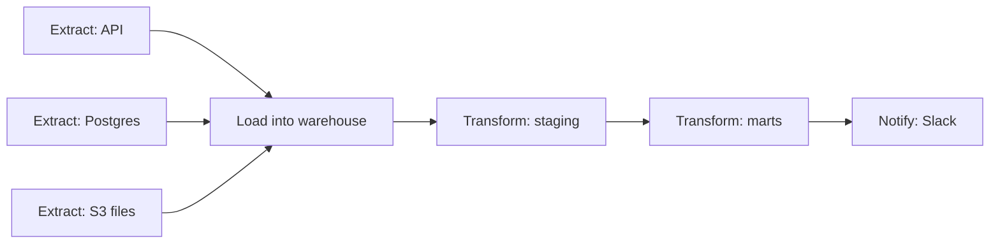
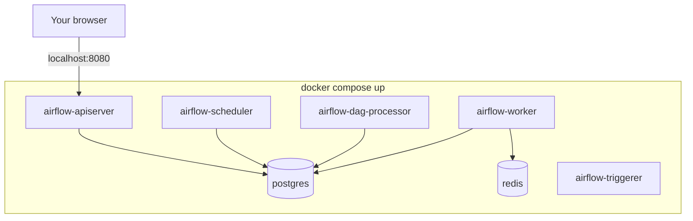
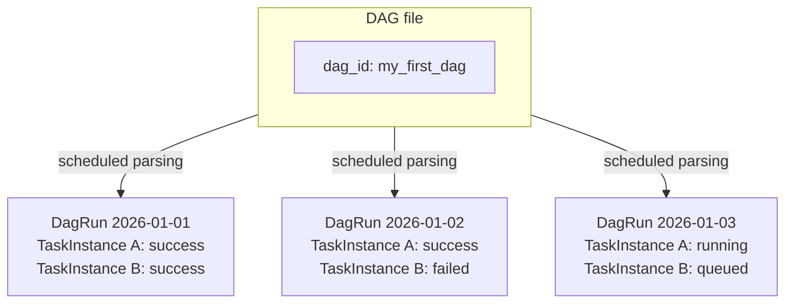
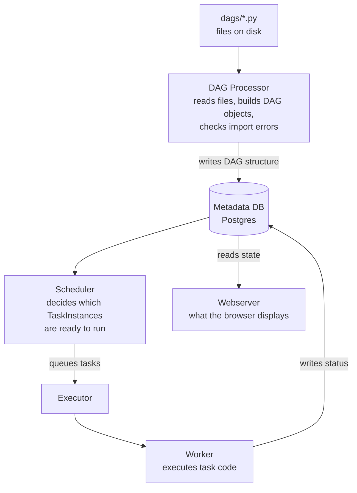
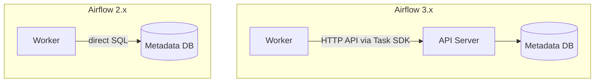
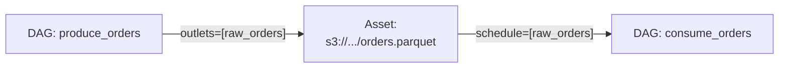
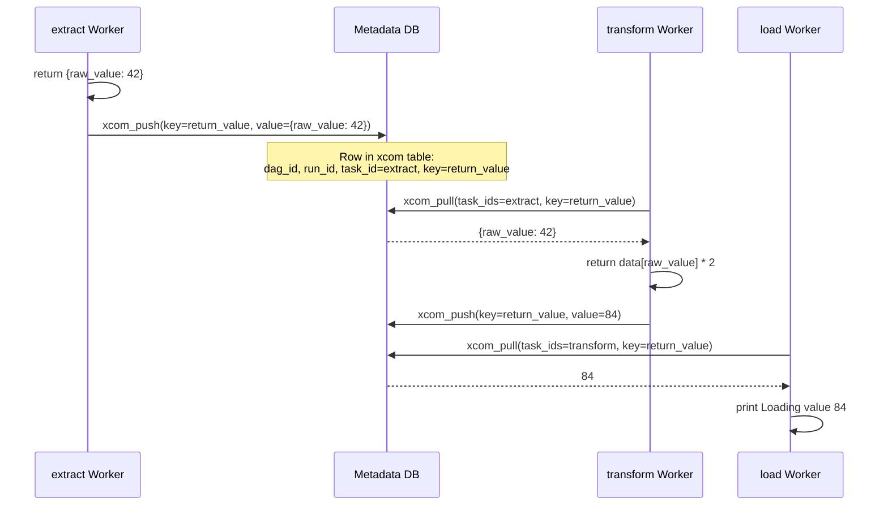
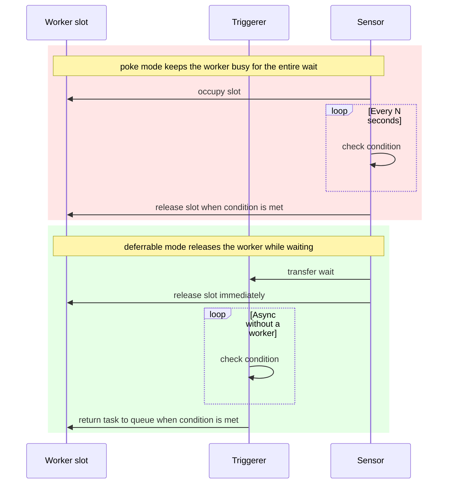

# 1. Introduction to Apache Airflow

**1.1 What Is Workflow Orchestration?**

**Workflow orchestration** is the coordination of a set of interdependent tasks that run on a schedule or in response to an event, taking execution order, failures, parallelism, and observability into account.

The typical path that leads a team to an orchestrator starts with a single cron job that runs a SQL script once a day. Then a second job appears and must run only after the first one. Then a third job occasionally fails, and someone has to log in and restart everything from the beginning because nobody knows how far the pipeline got. cron is excellent at “run X at 3 a.m.,” but it has no dependency model: it does not know that task B must wait for task A, does not retain execution history, and does not support retries.

A real ETL/ELT pipeline is almost never linear. It is a graph:



An orchestrator expresses exactly this structure: “run L only after all three Extract tasks have completed successfully,” which cron fundamentally cannot do.

**An important limitation to understand up front:** Airflow is a **batch** orchestrator. It executes a set of steps on a schedule or in response to an event; it does not process real-time data streams. Streaming workloads use other tools, such as Kafka Streams or Flink.

**1.2 Key Features and Benefits of Apache Airflow**

| Feature | Problem it solves |
| --- | --- |
| DAGs as Python code | A pipeline follows the same process as any other code: Git, pull requests, and review |
| Providers and ready-made integrations | You do not need to build BigQuery, Postgres, or S3 integrations from scratch; hundreds of operators are available |
| Observability UI | One graph in one UI instead of logs spread across three servers |
| Extensibility | You can write a custom hook or operator for a non-standard system |
| Backfill | Reprocesses historical intervals, although idempotency remains the DAG author's responsibility |

**Drawbacks to understand immediately:**

- The learning curve is steeper than with simpler tools. The **DAG, Task, and Operator** subsection unpacks the DAG, Task, Operator, and TaskInstance concepts carefully.
- The Scheduler can become a bottleneck with a large number of DAGs. Performance optimization is outside the scope of this introductory day.

**1.3 Airflow 2.x and 3.x Overview**

The key architectural change in 3.x is that a worker executing tasks no longer has **direct access to the metadata database**, as it did in 2.x. In 3.x, workers communicate with the system only through an HTTP API. Most of the new 3.x features follow from this single decision; **Airflow 3 Architecture in Detail** explains the consequences.

| Area | 2.x | 3.x |
| --- | --- | --- |
| Task execution | Worker has direct access to the metadata database | API Server and Task SDK provide isolation |
| Task languages | Python only | Java and Go added experimentally |
| UI | Flask-AppBuilder and Jinja | React and FastAPI |
| DAG versioning | Not available | DAG Versioning |
| Scheduling | Time and basic Datasets | Assets with partitioning and event-driven scheduling |
| Backfill | Separate manual CLI process | Built into the Scheduler and available through UI, API, and CLI |
| Default `catchup` | `True` | `False` |

**Practical consequence for teams migrating from 2.x:** DAG code that accesses Airflow's internal SQLAlchemy models directly, which is common in older projects, will fail with a full error on 3.x rather than merely emitting a warning.

# 2. Installation and Setup

Common installation and local runtime options include:

- **`pip` with a constraints file**: installs Airflow directly into a Python virtual environment. This gives full control but requires you to configure the metadata database, executor, and other services yourself.
- **`uv` with Airflow constraints**: a faster package-management alternative for creating a local Python environment. The same Airflow version and Python-version compatibility rules still apply.
- **`airflow standalone`**: starts an all-in-one local Airflow environment after the package is installed. It is the quickest option for learning and experimentation, but not a production deployment model.
- **Docker Compose**: uses the official `docker-compose.yaml` to run the API Server, Scheduler, DAG Processor, Triggerer, workers, Postgres, and Redis as separate containers. This is the most common development setup.
- **Astro CLI** by Astronomer: provides a Docker-based local Airflow environment with convenient project, dependency, test, and deployment commands.
- **Helm on a local Kubernetes cluster**: runs the official Airflow Helm chart on tools such as `kind`, `minikube`, or Docker Desktop Kubernetes. It is heavier, but useful for testing KubernetesExecutor and production-like infrastructure.
- **Breeze**: the Apache Airflow contributor environment for developing and testing Airflow itself. It is generally unnecessary for ordinary DAG development.

In this workshop, we will work with a local Airflow environment.



In Airflow 3.x, `airflow-dag-processor` is a required standalone service rather than part of the Scheduler.

**Installation:**

```bash
curl -LfO 'https://airflow.apache.org/docs/apache-airflow/stable/docker-compose.yaml'

mkdir -p ./dags ./logs ./plugins ./config

# Without this step, Docker Compose warns that FERNET_KEY/AIRFLOW_UID is not set.
echo -e "AIRFLOW_UID=$(id -u)\nFERNET_KEY=$(openssl rand -base64 32 | tr '+/' '-_')" > .env
# AIRFLOW_UID ensures correct permissions for files in mounted directories.
# FERNET_KEY encrypts sensitive fields such as passwords and extras in the metadata database.

docker compose up airflow-init   # One-time initialization: database migration and user creation.
docker compose up
```

The default username and password are `airflow` / `airflow`.

**Exercise**

_Task:_ Start Airflow locally, open `http://localhost:8080`, and confirm that the DAG list is visible.

_Verification:_

```bash
docker compose ps        # All services should be healthy.
```

_Diagnostics if startup fails:_

1. The UI does not open: run `docker compose logs airflow-apiserver --tail=50`.
2. A particular service is `unhealthy` or `restarting`: inspect that service's logs.
3. A DAG exists on disk but is not visible in the UI: check `DAGS_ARE_PAUSED_AT_CREATION`. The DAG may exist but be disabled and hidden by the “Active only” filter.

_Common mistakes:_

1. Skipping `docker compose up airflow-init`, which results in database migration errors.
2. Confusing the DAG filename with the `dag_id` defined in the decorator and searching the UI by filename. Verify it with `docker compose exec airflow-dag-processor airflow dags list | grep <part_of_dag_id>`.

**Check yourself:**

1. Why must `docker compose up airflow-init` run before `docker compose up`?

> [!example]- Answer
> It migrates the metadata database schema and creates the administrator account.

**Managed Cloud Options**

Managed Airflow platforms operate the control plane for you: they provision and upgrade Airflow components, monitor service health, scale workers, manage the metadata database, and integrate with the cloud provider's networking, identity, logging, and secrets services. Your team remains responsible for DAG code, dependencies, data access, testing, and cost control.

- **Google Cloud Composer**: managed Airflow on GKE, with DAG files stored in a Cloud Storage bucket.
- **Astronomer (Astro)**: a managed multi-cloud platform from the same vendor that develops Cosmos for dbt integration.
- **AWS MWAA**: AWS's managed service, with DAGs stored in an S3 bucket.

The common trade-off is less operational overhead in exchange for higher cost and restrictions on Airflow versions, provider packages, plugins, networking, and infrastructure customization. When choosing a platform, consider where the data already lives, which cloud identity model the organization uses, supported Airflow versions, private-network requirements, autoscaling behavior, and how easily DAGs can be promoted across environments.

For this workshop, managed platforms are useful context, but all exercises run in the local Docker Compose environment from **Installation and Setup**.

# 3. Navigating the UI

**Web Interface**

The main UI sections are:

- **DAGs list**: all DAGs, their status and schedule, and an on/off toggle.
- **Grid view**: a DagRun × Task matrix where color represents status. This is the main dashboard for daily work.
- **Graph view**: dependency visualization for a particular run.
- **Gantt view**: task durations and ordering over time, useful for finding bottlenecks.
- **Task Instance Details**: logs, XCom as explained in **TaskFlow API**, retry attempts, and rendered templates.
- **Code view**: DAG source code directly in the UI.
- **Admin → Connections / Variables / Pools / XComs**: configuration.
- **Asset view**, available only in 3.x: the data dependency graph explained in **Airflow 3 Architecture in Detail**.

**Monitoring DAG Runs, Tasks, and Logs**

TaskInstance states include `queued`, `running`, `success`, `failed`, `up_for_retry`, `skipped`, `upstream_failed`, and `removed`.

**`upstream_failed`** means that the task was never attempted because a task it depends on failed. Empty logs are expected in this state and are not a bug.

By default, logs are stored locally on the worker. This is a problem in production because logs disappear when a worker is recreated, so remote logging to S3, GCS, or Elasticsearch is normally configured.

# 4. Architecture and Core Concepts

**DAG, Task, and Operator**

Three terms must be clearly understood before the rest of the course will make sense:

- **Operator**: a class-level action template describing what a kind of building block can do, such as run a Bash command, call a Python function, or execute SQL. It is analogous to a class in object-oriented programming.
- **Task**: a particular operator instance inside a particular DAG, with a unique `task_id`. It is analogous to an object created from a class.
- **TaskInstance**: one execution of one task in one DagRun, with its own state such as `success`, `failed`, or `running`. It is analogous to the state of an object at a particular moment.

A dbt analogy: an `Operator` is like a reusable macro or materialization; a `Task` is a particular model using it; and a `TaskInstance` is one execution of that model in a particular `dbt run`.

```python
from airflow.operators.bash import BashOperator

# BashOperator is an Operator: a class template that can run a Bash command.

say_hello = BashOperator(
    task_id="say_hello",          # This is a Task: a specific BashOperator instance.
    bash_command="echo Hello",    # Its specific behavior.
)

# You do not create TaskInstances in DAG code. Airflow creates one for every run:
#   TaskInstance(task_id="say_hello", run_id="2026-01-01", state="success")
#   TaskInstance(task_id="say_hello", run_id="2026-01-02", state="failed")
# These are the squares displayed in Grid view.
```

**A DAG file is a blueprint, not a process.** Airflow periodically rereads the file and creates actual runs from that blueprint:



**Basic operator categories:**

- **Action operators** perform an action: `BashOperator`, `PythonOperator`, and `SQLExecuteQueryOperator`.
- **Transfer operators** move data between systems.
- **Sensors** wait for a condition.
- **Deferrable variants** do not consume a worker slot while waiting.

**Connection, briefly.** Before discussing Hooks, we need to name the abstraction on which they depend. A **Connection** stores the parameters for connecting to an external system, including host, login, password, port, and extra fields. Connections are managed centrally through Admin → Connections, the CLI, or environment variables rather than hardcoded into DAGs. Code refers to a Connection by its `conn_id`:

```python
# conn_id refers to a Connection configured in Admin rather than hardcoding a host or password.
postgres_conn_id = "my_postgres"
```

The same code using `conn_id="my_postgres"` can point to different databases in development and production, while credentials remain outside the source code. **Connecting to Databases and Storage** on Day 2 configures real Connections.

**Hook, briefly.** A **Hook** is an adapter for an external system that encapsulates authentication and low-level operations such as running SQL, listing S3 files, or making an HTTP request. A Hook is not an Operator. It is a building block used by Operators and can also be called directly from an `@task` function:

```python
from airflow.providers.postgres.hooks.postgres import PostgresHook

hook = PostgresHook(postgres_conn_id="my_postgres")  # A Connection reference, not a hardcoded secret.
result = hook.get_first("SELECT COUNT(*) FROM my_table;")
```

**Operators, Sensors, and Hooks** provides hands-on Hook examples for Postgres, S3, HTTP, and Slack.

**Variable, briefly.** Another core configuration entity is a **Variable**. Unlike a Connection, it does not connect to anything; it is key-value configuration that should not be hardcoded, such as an alert threshold, target bucket name, or feature flag. Variables are managed through Admin → Variables or the CLI and read inside tasks:

```python
from airflow.sdk import Variable

@task
def load_data():
    bucket = Variable.get("target_bucket")  # Read inside the task, not at the top level of the file.
    print(f"Loading into {bucket}")
```

A warning: calling `Variable.get()` at the top level of a DAG file, outside an `@task`, adds an API Server request every time the DAG Processor scans the file. Read Variables strictly inside task bodies. **Connecting to Databases and Storage** on Day 2 covers Variables, Connections, and Pools in more detail.

**XCom, briefly.** XCom stands for **cross-communication** and lets tasks exchange small values. It is neither a file nor shared memory. Physically, XCom values are rows in the metadata database identified by DAG, run, task ID, and key. When one `@task` function returns a value and another receives it as an argument, XCom works transparently underneath:

```python
@task
def extract():
    return {"raw_value": 42}  # Stored in XCom.

@task
def transform(data: dict):  # Read from XCom.
    return data["raw_value"] * 2
```

This is TaskFlow style, where push and pull operations are hidden behind ordinary function calls. In classic `PythonOperator` code, common in older projects, the same operation is explicit:

```python
from airflow.operators.python import PythonOperator

def extract_classic(**context):
    context["ti"].xcom_push(key="raw_value", value=42)

def transform_classic(**context):
    value = context["ti"].xcom_pull(task_ids="extract_classic", key="raw_value")
    print(value * 2)
```

Because XCom values are rows in a relational database rather than objects in file storage, do not pass large datasets, DataFrames, or files through XCom. Pass small values or paths to data instead. **TaskFlow API** provides a full explanation, including multiple values and explicit push/pull.

**Sensor, briefly.** A Sensor is a special Operator that **waits for a condition** rather than performing an immediate action: a file appears, a partition becomes available, or another DAG finishes. Traditional Sensors support `poke` mode, which holds a worker slot between checks, and `reschedule` mode, which releases the slot and asks the Scheduler to resume the task later. Sensors that support `deferrable=True` use a different execution mechanism: they delegate the wait to the Triggerer and resume when an event arrives.

```python
from airflow.sensors.filesystem import FileSensor

wait_for_file = FileSensor(
    task_id="wait_for_file",
    filepath="/tmp/ready.txt",
    fs_conn_id="fs_default",
    deferrable=True,
)
```

**Operators, Sensors, and Hooks** covers FileSensor, SqlSensor, ExternalTaskSensor, S3KeySensor, traditional `poke` and `reschedule` modes, and deferrable execution.

**Ten Operators frequently encountered in practice:**

| Operator | Package | Purpose |
| --- | --- | --- |
| `BashOperator` | <code>airflow.<wbr>operators.<wbr>bash</code> | Runs an arbitrary Bash command |
| `PythonOperator` | <code>airflow.<wbr>operators.<wbr>python</code> | Calls a Python function in the classic, pre-`@task` style |
| `SQLExecuteQueryOperator` | <code>airflow.<wbr>providers.<wbr>common.<wbr>sql.<wbr>operators.<wbr>sql</code> | Executes SQL through a specified Connection |
| `PostgresOperator` | <code>airflow.<wbr>providers.<wbr>postgres.<wbr>operators.<wbr>postgres</code> | Executes SQL specifically against Postgres |
| `BigQueryInsertJobOperator` | <code>airflow.<wbr>providers.<wbr>google.<wbr>cloud.<wbr>operators.<wbr>bigquery</code> | Starts a BigQuery job |
| `S3ToRedshiftOperator` | <code>airflow.<wbr>providers.<wbr>amazon.<wbr>aws.<wbr>transfers.<wbr>s3_to_redshift</code> | Transfers data from S3 to Redshift |
| `FileSensor` | <code>airflow.<wbr>sensors.<wbr>filesystem</code> | Waits for a file on disk |
| `ExternalTaskSensor` | <code>airflow.<wbr>sensors.<wbr>external_task</code> | Waits for a task in another DAG |
| `SqlSensor` | <code>airflow.<wbr>providers.<wbr>common.<wbr>sql.<wbr>sensors.<wbr>sql</code> | Waits for a non-empty SQL result |
| `EmptyOperator` | <code>airflow.<wbr>operators.<wbr>empty</code> | Does nothing and acts as a graph join point |

**Exercise**

_Task:_ Write a `bash_dependencies_demo` DAG with four tasks:

- `start` runs `date`.
- `task_a` runs `echo 'Processing A'; sleep 2`.
- `task_b` runs `echo 'Processing B'; sleep 3`.
- `finish` runs `echo 'Done'`.

The dependencies are `start` → `task_a` and `task_b` in parallel → `finish`, which runs only after both complete.

> [!example]- Solution
>
> ```python
> from airflow import DAG
> from airflow.operators.bash import BashOperator
> from datetime import datetime
>
> with DAG(
>     dag_id="bash_dependencies_demo",
>     start_date=datetime(2026, 1, 1),
>     schedule="@daily",
>     catchup=False,
> ) as dag:
>     start = BashOperator(task_id="start", bash_command="date")
>     task_a = BashOperator(task_id="task_a", bash_command="echo 'Processing A'; sleep 2")
>     task_b = BashOperator(task_id="task_b", bash_command="echo 'Processing B'; sleep 3")
>     finish = BashOperator(task_id="finish", bash_command="echo 'Done'")
>
>     start >> [task_a, task_b] >> finish
> ```
>
> _Explanation:_ `start >> [task_a, task_b]` creates a dependency from `start` to each list element separately. Both tasks wait for `start`, but do not wait for each other, so they run in parallel. `[task_a, task_b] >> finish` makes `finish` wait for **both** tasks. By default, `finish` does not run if either fails.

_Common mistakes:_

1. Writing `start >> task_a >> task_b >> finish` as a chain instead of using a list, which makes the tasks sequential rather than parallel.
2. Not realizing that `finish` waits for both tasks by default and wondering why it does not start while `task_b` is still running.

_Verification:_ In Graph view, `task_a` and `task_b` appear on the same level. `finish` appears to their right with two incoming arrows.

**Check yourself:**

1. What is the difference between an Operator and a Task?
2. How does a Hook differ from a Sensor?
3. What happens if you write `start >> task_a >> task_b >> finish` instead of `start >> [task_a, task_b] >> finish`?

> [!example]- Answers
> 1. An Operator is a class template; a Task is a specific instance inside a DAG.
> 2. A Hook is an adapter for interacting with an external system, while a Sensor is an Operator that waits for a condition.
> 3. Parallelism is lost and the tasks run sequentially.

**4.2 Scheduler, Webserver, and Worker Overview**

Once a DAG file is placed in the `dags/` directory, several independent processes take part:



**DAG Processor.** In Airflow 3.x, this is always a standalone process rather than part of the Scheduler. It periodically scans the `dags/` directory, imports each file by executing it as Python code, and writes the resulting DAG object structure to the metadata database. If importing a file fails, it records an import error and the DAG does not appear in the system. The DAG Processor executes the file **in full** on every scan, not only the bodies of `@task` functions. Heavy top-level work therefore runs during every scan rather than only during task execution.

**Metadata database (Postgres).** This is the single source of truth for the entire system: DAG structure, execution states, XCom, Connections, Variables, and Pools are all stored in this database.

**Scheduler.** This long-running process queries the metadata database every few seconds: “Which DAGs are due to run? Which TaskInstances have all dependencies satisfied?” When it finds a ready task, it changes the state to `queued` and passes it through the Executor. The Scheduler does not execute task code itself.

**Executor vs. Worker: the key distinction.** An **Executor is a strategy**, not a process. It is code inside the Scheduler that decides where to send the message “execute this task” and how to receive the resulting status. A **Worker is the physical process**, or Pod, that executes the code:

- **CeleryExecutor** puts a message into Redis or RabbitMQ; the Worker is a Celery process listening to that queue.
- **KubernetesExecutor** calls the Kubernetes API; the Worker is a newly created Pod that lives for the duration of the task.
- **LocalExecutor** starts a child process on the same machine; that child process is the Worker.

The same Scheduler creates workers in very different ways depending on its Executor. Think of the Executor as a taxi dispatcher deciding which driver receives a trip, and the Worker as the driver who physically performs it.

**Webserver, part of the API Server in 3.x.** It reads state from the metadata database and renders the UI. In 3.x it is also the endpoint through which Workers obtain assignments and Connections via the Task Execution API described in **Airflow 3 Architecture in Detail**.

**Triggerer.** This standalone process handles waiting tasks such as Sensors and deferrable Operators. It uses an asyncio event loop, does not consume a worker slot while waiting, and can manage hundreds of waits in one process.

**Check yourself:**

1. Who physically executes task code, the Scheduler or the Executor/Worker?
2. What is the difference between an Executor and a Worker?

> [!example]- Answers
> 1. The Executor/Worker; the Scheduler only decides that a task is ready.
> 2. An Executor is strategy and routing logic inside the Scheduler; a Worker is the physical executor created or selected by that strategy.

**4.3 Executors and Backends at a Glance**

- An **Executor** is the execution strategy: one process, a process pool, a Celery worker pool, or a separate Kubernetes Pod for each task.
- A **backend** is infrastructure used by the Executor: the metadata database is always required, while a Redis or RabbitMQ message queue is required only by Celery.

| Executor | How it works | When to use it |
| --- | --- | --- |
| SequentialExecutor | One task at a time with SQLite | Quick local testing only |
| LocalExecutor | Parallel child processes on one machine | Small to medium workloads |
| CeleryExecutor | A queue and a worker pool distributed across machines | Medium to high, predictable workloads |
| KubernetesExecutor | A separate Kubernetes Pod for every task | Resource isolation and uneven workloads |

**Why this matters in practice:** the Executor determines not only execution speed, but also how many systems must be operated. CeleryExecutor introduces Redis or RabbitMQ as another component that can fail and needs monitoring. KubernetesExecutor does not need that queue, but depends on the health of the Kubernetes API. The metadata database is always required and is the only truly mandatory backend.

For example, 200 dbt models running every night with similar resource demands fit a fixed CeleryExecutor pool with predictable cost. Infrequent heavy ML jobs mixed with lightweight dbt models are a better fit for KubernetesExecutor because resource isolation prevents a heavy job from consuming the worker needed for a light one.

**Check yourself:**

1. Which backend is always required, and which is required only by Celery?

> [!example]- Answer
> The metadata database is always required; Redis or RabbitMQ is required only by CeleryExecutor.

**4.4 Airflow 3 Architecture in Detail**

**Why the architecture needed to be rebuilt.** In 2.x, workers had direct access to the metadata database. This created four problems:

1. **Security:** a compromised worker could access or modify unrelated data directly.
2. **Python only:** execution depended on internal Python objects.
3. **Database load:** increasing the number of workers risked exhausting Postgres connections.
4. **Outdated UI stack:** Flask-AppBuilder and Jinja were difficult to evolve.

**Task Execution API and Task SDK**



The **Task SDK** is the stable contract imported by DAG code with `from airflow.sdk import dag, task`. Its consequences are:

1. **Isolation:** a worker cannot directly damage or read unrelated database data.
2. **Polyglot execution:** tasks can be written in languages other than Python, experimentally.
3. **Tasks can run anywhere:** a worker needs only outbound HTTP(S) access to the API Server, not direct database or broker access, which enables Edge Executor.
4. **Less database load:** the API Server pools database connections centrally.

**Migration consequence:** direct access to Airflow's internal models or database fails with an error rather than a warning. `SubDagOperator` has been removed completely and should be replaced by `TaskGroup`.

**DAG Versioning.** In 2.x, if DAG code changed while a run was in progress, it could be unclear which graph structure was actually executed. In 3.x, a **DagRun finishes using the DAG version with which it started**, even when the source changes mid-run. This provides reproducibility and safer live updates. Airflow 3.3 adds `run_on_latest_version` for explicit control during reruns and backfills.

**Assets and event-driven scheduling**

Datasets, introduced in the 2.x line with 2.4, were renamed and expanded into **Assets**. A DAG can start when a particular Asset is updated rather than running “just in case” on a fixed schedule. This expresses dependencies at the data level rather than only at the time level.

**Example 1: declaring and producing an Asset**

```python
from airflow.sdk import Asset, dag, task
from datetime import datetime

# An Asset describes a dataset and is identified by its URI.
raw_orders = Asset("s3://my-bucket/raw/orders.parquet")

@dag(schedule="@daily", start_date=datetime(2026, 1, 1), catchup=False)
def produce_orders():

    @task(outlets=[raw_orders])  # outlets lists the Assets produced or updated by this task.
    def extract_orders():
        # Data extraction logic goes here.
        print("Data extracted and written to s3://my-bucket/raw/orders.parquet")

    extract_orders()

produce_orders()
```

**Example 2: a DAG triggered by an Asset update instead of a time schedule**

```python
from airflow.sdk import Asset, dag, task

raw_orders = Asset("s3://my-bucket/raw/orders.parquet")

@dag(schedule=[raw_orders], catchup=False)
def consume_orders():

    @task
    def process_orders():
        print("I am running because raw_orders was updated")

    process_orders()

consume_orders()
```

**Example 3: waiting for two Assets to be updated**

```python
from airflow.sdk import Asset, dag, task

raw_orders = Asset("s3://my-bucket/raw/orders.parquet")
raw_customers = Asset("s3://my-bucket/raw/customers.parquet")

@dag(schedule=[raw_orders, raw_customers], catchup=False)
def consume_orders_and_customers():

    @task
    def build_joined_table():
        print("Orders and customers are both fresh, so they can be joined")

    build_joined_table()

consume_orders_and_customers()
```

**An Asset connects DAGs through data rather than direct task dependencies:**



Unlike `ExternalTaskSensor`, covered in **Operators, Sensors, and Hooks**, an Asset dependency is a declarative relationship through the data object itself and is visible in the dedicated **Asset view**. A Sensor polls whether a specific task in another DAG has completed. Asset dependencies are not tied to a particular `task_id` in a particular DAG.

The same idea maps naturally to dbt models. A model that writes a table can be represented as an Asset. Instead of refreshing a BI dashboard on a schedule “one hour after transformation, just in case,” the refresh can start exactly when the required data is updated.

**Event-driven scheduling** goes further by triggering DAGs from external events through a pluggable message bus, initially AWS SQS in 3.0. Airflow 3.2 added **Asset partitioning** to track individual portions of an Asset, such as date partitions.

**New UI and API.** React and FastAPI replace Flask-AppBuilder and Jinja. The new **Asset view** visualizes data dependency graphs.

**airflowctl.** In 3.x, this separate package communicates with Airflow exclusively through the API and is intended for remote administration and CI/CD. The `airflow` CLI remains available for local commands.

**Backfill.** In 3.x, backfill is processed by the same Scheduler as normal runs and is available through UI, API, and CLI rather than only through a terminal process.

**Edge Executor.** This allows tasks to run on remote nodes. Remote execution itself also existed with Celery and Kubernetes in 2.x; the difference is networking. A 2.x remote worker needed direct access to the metadata database or broker, often through a VPN. In 3.x, it only needs outbound HTTPS access to the API Server.

**Polyglot tasks through the Language Task SDK, AIP-108, are experimental.**

> [!warning]
> The following example is theoretical and should not be copied into production. The API may change, and the SDK is not included with `pip install apache-airflow`.

```toml
[sdk]
coordinators = {
    "go": {
        "classpath": "airflow.sdk.coordinators.executable.ExecutableCoordinator",
        "kwargs": {"executables_root": ["~/airflow/executable-bundles"]}
    }
}
queue_to_coordinator = {"go_workers": "go"}
```

```python
from airflow.sdk import dag, task
from datetime import datetime

@dag(schedule="@daily", start_date=datetime(2026, 1, 1), catchup=False)
def go_powered_pipeline():

    @task.stub(queue="go_workers")  # No Python implementation: this is a stub.
    def process_large_file():
        ...

    process_large_file()

go_powered_pipeline()
```

```go
// executable-bundles/go/task.go
package main

import "github.com/apache/airflow/go-sdk/task"

func main() {
    task.Run(func(ctx task.Context) (any, error) {
        input := ctx.GetXCom("input_path")
        result := processFile(input.(string))
        return result, nil
    })
}
```

The end-to-end path is: the Scheduler creates a TaskInstance in the `go_workers` queue; the Worker finds `ExecutableCoordinator` through `queue_to_coordinator`; the coordinator starts a binary from `executables_root`; XCom input is passed into the Go process; and the result is proxied back as a normal XCom value.

**Recent additions in 3.2 and 3.3:**

- **State store (AIP-103):** state storage for tasks and Assets across runs.
- **Multi-team deployments (3.2):** resource and access isolation between teams.
- **Pluggable retry policies (3.3):** customizable retry logic.
- **`@skip_if` / `@run_if` (3.3):** conditional skipping and execution without `ShortCircuitOperator`.
- **OpenTelemetry Traces:** built-in execution tracing.
- MSSQL is no longer supported as a metadata database backend.

**Airflow 2.x → 3.x migration checklist:**

1. Direct access to internal models or the database will fail.
2. Replace `SubDagOperator` with `TaskGroup`.
3. Replace `airflow` with `airflowctl` for remote CI/CD administration.
4. Revisit polling Sensors when migrating Datasets to Assets and consider Asset-based dependencies.
5. Managed providers support migration at different speeds.
6. This is a change to the execution model, so thorough pre-production testing is mandatory.

**Self-check exercise**

_Task:_ Consider this code from an Airflow 2.x DAG:

```python
from airflow.models import Connection
from airflow import settings

def get_conn_password(**context):
    session = settings.Session()
    conn = session.query(Connection).filter(Connection.conn_id == "my_postgres").first()
    return conn.password
```

What happens after migration to 3.x, and why?

> [!example]- Solution
> It fails. `session = settings.Session()` directly accesses the metadata database through SQLAlchemy, but workers no longer have that access in 3.x. Use `PostgresHook(postgres_conn_id="my_postgres")`, which communicates through the API Server.

**Check yourself:**

1. Which four 2.x problems does the 3.x architecture address?
2. How does `schedule=[asset]` differ from `ExternalTaskSensor`?
3. What does a remote Edge Executor machine physically need in 3.x?

> [!example]- Answers
> 1. Direct database access security, Python coupling, database connection load, and the outdated UI stack.
> 2. An Asset is a declarative data dependency visible in Asset view; a Sensor polls a particular task in a particular DAG.
> 3. Only outbound HTTPS access to the API Server.

# 5. Developing DAGs

**5.1 TaskFlow API**

Before Airflow 2.0, passing data between `PythonOperator` tasks required manually calling `context["ti"].xcom_push(...)` in one task and `context["ti"].xcom_pull(...)` in another, including manual key management. A typo in a key returned `None` without any error. The TaskFlow API, using `@dag` and `@task`, makes this transfer transparent: a function's return value automatically becomes an XCom that can be passed to another task as a normal argument.

```python
from airflow.decorators import dag, task
from datetime import datetime

@dag(schedule="@daily", start_date=datetime(2026, 1, 1), catchup=False)
def etl_pipeline():

    @task
    def extract():
        return {"raw_value": 42}  # return is an implicit xcom_push with key "return_value".

    @task
    def transform(data: dict):  # The argument implicitly pulls the result of extract().
        return data["raw_value"] * 2

    @task
    def load(value: int):
        print(f"Loading value: {value}")

    load(transform(extract()))  # Dependencies are inferred from arguments rather than >>.

etl_pipeline()  # The DAG function must be called or it will not be registered.
```

Dependencies are inferred from argument passing, so `>>` is not needed here.

**What XCom is physically.** XCom, or cross-communication, is not a file or process memory. It consists of rows in the **same metadata database**, each identified by `(dag_id, run_id, task_id, key)`.



`transform` and `load` are different Worker processes and may even run on different machines with CeleryExecutor. They do not share memory. The only way for them to exchange values is by writing to and reading from a shared database. TaskFlow hides `xcom_push` and `xcom_pull` behind normal function-call syntax, but this database exchange still happens physically.

This directly explains XCom's size limitation. Passing DataFrames with millions of rows through a relational database inflates Airflow's production database. Store large values in external storage such as disk, S3, or GCS, and pass only the file path through XCom.

**Classic style, commonly found in older code:**

```python
from airflow.operators.python import PythonOperator

def extract_classic(**context):
    context["ti"].xcom_push(key="raw_value", value=42)

def transform_classic(**context):
    value = context["ti"].xcom_pull(task_ids="extract_classic", key="raw_value")
    print(value * 2)
```

**Exercise**

_Task:_ Rewrite the `bash_dependencies_demo` from **DAG, Task, and Operator** with TaskFlow while preserving `start` → `[A, B]` → `finish`.

> [!example]- Solution
>
> ```python
> from airflow.decorators import dag, task
> from datetime import datetime
>
> @dag(schedule="@daily", start_date=datetime(2026, 1, 1), catchup=False)
> def taskflow_dependencies_demo():
>
>     @task
>     def start():
>         print("Starting pipeline")
>
>     @task
>     def task_a():
>         print("Processing A")
>
>     @task
>     def task_b():
>         print("Processing B")
>
>     @task
>     def finish():
>         print("Done")
>
>     start_task, task_a_instance, task_b_instance, finish_task = start(), task_a(), task_b(), finish()
>     start_task >> [task_a_instance, task_b_instance] >> finish_task
>
> taskflow_dependencies_demo()
> ```
>
> _Explanation:_ Dependencies use `>>` because these tasks do not pass data to one another. TaskFlow does not eliminate `>>`; it eliminates manual XCom where data is actually transferred.

_Common mistakes:_

1. Omitting intermediate variables while trying to pass data and define explicit dependencies at the same time.
2. Confusing graph construction time with execution time. Calling an `@task` function creates a task node; it does not execute the function body immediately.

**Check yourself:**

1. Why does the example use `>>` if TaskFlow infers dependencies from data?
2. What happens if `etl_pipeline()` is not called at the end of the file?

> [!example]- Answers
> 1. `start` and `finish` do not pass data to other tasks, so no data dependency can be inferred.
> 2. Airflow does not register the DAG.

**5.2 Operators, Sensors, and Hooks**

TaskFlow works well for custom code, but Hooks and Sensors are needed to connect to external systems and wait for external events. The **DAG, Task, and Operator** subsection introduces these abstractions.

**Hook Examples for Different Systems**

A **Hook** is an adapter for an external system that encapsulates authentication and low-level operations.

```python
from airflow.providers.postgres.hooks.postgres import PostgresHook

@task
def get_row_count():
    hook = PostgresHook(postgres_conn_id="my_postgres")  # Refers to a Connection from the Admin UI.
    return hook.get_first("SELECT COUNT(*) FROM my_table;")
```

```python
from airflow.providers.amazon.aws.hooks.s3 import S3Hook

@task
def list_s3_files():
    hook = S3Hook(aws_conn_id="my_aws")
    keys = hook.list_keys(bucket_name="my-bucket", prefix="raw/")
    print(f"Found {len(keys)} files")
    return keys
```

```python
from airflow.providers.http.hooks.http import HttpHook

@task
def call_rest_api():
    hook = HttpHook(method="GET", http_conn_id="my_api")
    response = hook.run(endpoint="/v1/orders")
    return response.json()
```

```python
from airflow.providers.slack.hooks.slack_webhook import SlackWebhookHook

@task
def notify_slack():
    hook = SlackWebhookHook(slack_webhook_conn_id="my_slack")
    hook.send(text="Pipeline completed successfully")
```

All Hooks follow the same principle: the constructor accepts a `*_conn_id` referring to a Connection configured in Admin → Connections, while Hook methods implement concrete interaction logic such as SQL queries, file listing, HTTP calls, or message delivery.

**Sensor Examples and Execution Strategies**

A **Sensor** is a special Operator that waits for a condition. Traditional Sensors have two modes, configured with the `mode` parameter:

- **`poke`**, the default, wakes periodically to check the condition and **consumes a worker slot** throughout the wait.
- **`reschedule`** releases the worker slot between checks and asks the Scheduler to reschedule the task for the next check.

**Deferrable execution is not a third `mode` value.** When a Sensor supports `deferrable=True`, it delegates the wait to the Triggerer, which monitors the condition asynchronously and returns the task to a worker only when it is ready to resume.



**FileSensor waits for a file on disk:**

```python
from airflow.sensors.filesystem import FileSensor

wait_for_file = FileSensor(
    task_id="wait_for_file",
    filepath="/tmp/ready.txt",
    fs_conn_id="fs_default",
    poke_interval=30,
    timeout=60 * 10,
    deferrable=True,
)
```

**SqlSensor waits for a non-empty SQL result:**

```python
from airflow.providers.common.sql.sensors.sql import SqlSensor

wait_for_load = SqlSensor(
    task_id="wait_for_load_complete",
    conn_id="my_postgres",
    sql="SELECT 1 FROM load_status WHERE status = 'complete' AND load_date = '{{ ds }}'",
    # {{ ds }} is an Airflow Jinja macro rendered as the current DagRun logical date in YYYY-MM-DD.
    # Inspect its actual value in UI → Task Instance Details → Rendered Template.
    deferrable=True,
)
```

A typical use is waiting for raw data to become genuinely available before starting an expensive transformation rather than scheduling it at a fixed time with an arbitrary safety margin.

**ExternalTaskSensor waits for a task in another DAG:**

```python
from airflow.providers.standard.sensors.external_task import ExternalTaskSensor

wait_for_ingestion = ExternalTaskSensor(
    task_id="wait_for_raw_load",
    external_dag_id="fivetran_ingestion",
    external_task_id="load_complete",
    deferrable=True,
)
```

**S3KeySensor waits for an object in S3:**

```python
from airflow.providers.amazon.aws.sensors.s3 import S3KeySensor

wait_for_s3_file = S3KeySensor(
    task_id="wait_for_s3_file",
    bucket_name="my-bucket",
    bucket_key="raw/{{ ds }}/orders.parquet",
    aws_conn_id="my_aws",
    deferrable=True,
)
```

In one sentence: `SqlSensor` checks the state of **data**, `ExternalTaskSensor` checks the state of **another DAG**, and `S3KeySensor` or `FileSensor` checks for an **object in storage**. Choose according to the real source of truth for readiness.

**Exercise**

_Task:_ Create a DAG that waits for `/tmp/ready.txt` and then prints its contents.

> [!example]- Solution
>
> ```python
> from airflow.decorators import dag, task
> from airflow.sensors.filesystem import FileSensor
> from datetime import datetime
>
> @dag(schedule="@daily", start_date=datetime(2026, 1, 1), catchup=False)
> def wait_for_file_demo():
>
>     wait_for_file = FileSensor(
>         task_id="wait_for_file",
>         filepath="/tmp/ready.txt",
>         fs_conn_id="fs_default",
>         poke_interval=30,
>         timeout=60 * 10,
>         deferrable=True,
>     )
>
>     @task
>     def read_file():
>         with open("/tmp/ready.txt") as file:
>             print(file.read())
>
>     wait_for_file >> read_file()
>
> wait_for_file_demo()
> ```
>
> _Live verification:_
>
> ```bash
> airflow dags trigger wait_for_file_demo
> # In another terminal, a little later:
> echo "hello from sensor demo" > /tmp/ready.txt
> ```
>
> _Explanation:_ While the file is absent, Grid view shows the task as deferred and no Worker is occupied. When the file appears, the Triggerer returns the task to the queue.

_Common mistakes:_

1. An incorrect `fs_conn_id` causes a “connection not found” error that may seem unrelated to waiting for a file.
2. A timeout that is too short for a live demonstration.

**Check yourself:**

1. How does `deferrable=True` differ from `poke` in resource usage?
2. Fifty DAGs each begin with a Sensor that waits up to 20 minutes in `poke` mode. What should change?

> [!example]- Answers
> 1. `poke` occupies a worker slot for the full wait; deferrable mode transfers the wait to the Triggerer and releases the Worker.
> 2. Enable `deferrable=True` to release 50 worker slots.

**5.3 CLI Commands**

```bash
airflow dags list                                         # List all DAGs.
airflow tasks list my_first_dag                           # List tasks in a DAG.

# Run one task locally without recording it in the database: a quick logic check.
airflow tasks test my_first_dag say_hello 2026-01-01

airflow dags trigger my_first_dag                         # Trigger a full DagRun manually.

airflow dags backfill my_first_dag \
  --start-date 2026-01-01 --end-date 2026-01-07           # Reprocess historical intervals.

airflow connections list
airflow variables list
```

**`airflow tasks test`** is the fastest way to verify the logic of one task without waiting for the Scheduler. In Airflow 3.x, this mode **does not write a full TaskInstance record to the metadata database or create a log file**. Output goes directly to the terminal. Trigger a real DAG run with `airflow dags trigger` to obtain logs in the UI.

**Exercise**

_Task:_ Find the error in this DAG using `tasks test`:

```python
from airflow.decorators import dag, task
from datetime import datetime

@dag(schedule="@daily", start_date=datetime(2026, 1, 1), catchup=False)
def buggy_dag():

    @task
    def compute():
        values = [1, 2, 3, 4, 5]
        return sum(values) / len(value)  # Typo: value instead of values.

    compute()

buggy_dag()
```

> [!example]- Solution
>
> ```bash
> airflow tasks test buggy_dag compute 2026-01-01
> ```
>
> The output is `NameError: name 'value' is not defined`. Change the expression to `return sum(values) / len(values)`. After the fix, the command completes without a traceback and prints `3.0`.

_Common mistakes:_

1. Looking for the result of `tasks test` in the UI and forgetting that this mode writes neither a TaskInstance nor a log file.
2. Mixing up the argument order: `dag_id task_id date`.

**Check yourself:**

1. What is the fastest way to check the code of a newly written task?

> [!example]- Answer
> Run `airflow tasks test <dag_id> <task_id> <date>`.

# Day 1 Wrap-up

The day covers the full foundation of the course in sequence: an introduction to Airflow and its versions; installation and local environment setup; UI navigation; architecture, including DAGs, Tasks, Operators, Hooks, Sensors, components, Executors, and a detailed look at Airflow 3 and Assets; and practical DAG development with TaskFlow, XCom, Operators, Sensors, Hooks, and the CLI.
