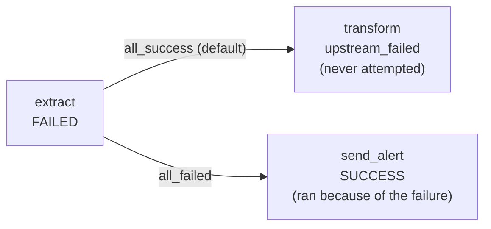
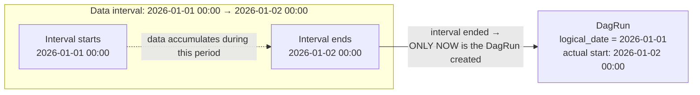
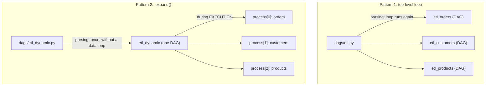
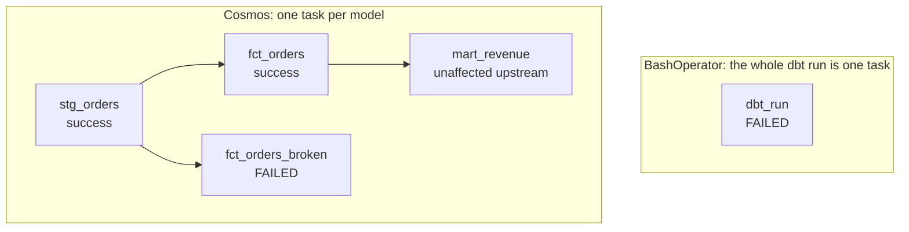
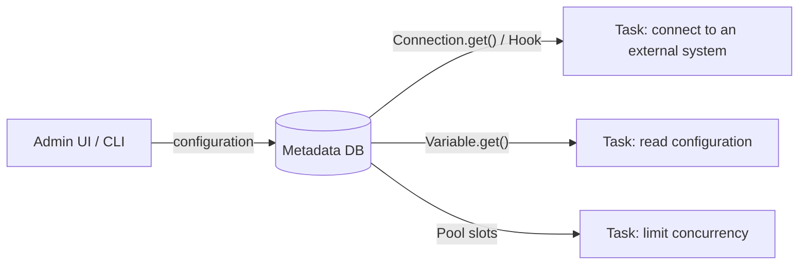

# 1. Dependencies and DAG Scheduling

**`trigger_rule`: Which Upstream Outcome Should Start a Task?**

By default, Airflow uses the `all_success` rule: a task starts only when **all** of its upstream tasks have completed successfully. This is intuitive for most cases, but not all of them. Failure alerts and cleanup tasks that must run regardless of the outcome require different behavior.

```python
from airflow.decorators import dag, task
from datetime import datetime

@dag(schedule="@daily", start_date=datetime(2026, 1, 1), catchup=False)
def trigger_rule_demo():

    @task
    def extract():
        raise ValueError("Source is unavailable")  # Fails intentionally.

    @task
    def transform():
        # The default trigger_rule="all_success" waits for extract to succeed.
        print("This task will not run because all_success is the default")

    @task(trigger_rule="all_failed")  # Runs only if the upstream task failed.
    def send_alert():
        print("This task runs precisely because extract failed")

    extract_task = extract()
    extract_task >> transform()   # This branch becomes upstream_failed.
    extract_task >> send_alert()  # This branch runs because of all_failed.

trigger_rule_demo()
```



Other `trigger_rule` values include `all_success` (default), `all_failed`, `one_success`, `one_failed`, `none_failed`, and `all_done`. `all_done` runs regardless of upstream outcomes and is useful for a final cleanup or notification step.

# 2. Data Interval

The anchor idea is: **“The DagRun for January 1 actually starts at the beginning of January 2 because Airflow waits for the interval to finish completely.”**

Airflow was designed around batch processing for a **completed past period**. If a pipeline must process “all sales from January 1,” the data is not complete until January 1 ends. Airflow therefore schedules the DagRun with `logical_date = 2026-01-01` only **after** the interval `[2026-01-01 00:00, 2026-01-02 00:00)` ends, at 2026-01-02 00:00.



If the UI shows `logical_date = 2026-01-15` while the actual start time is `2026-01-16 00:05`, that is neither a bug nor Scheduler latency. It is the expected data-interval behavior.

**`catchup` in Airflow 3.x: The Default Changed**

In Airflow 2.x, `catchup_by_default` was `True`, which created a classic trap: enabling a DAG could produce hundreds of historical runs. **Starting with Airflow 3.0, the default changed to `False`**, the opposite of 2.x behavior. If you previously worked with 2.x, code that explicitly used `catchup=False` as protection is now protected by default. When historical runs are genuinely required after enabling a DAG, request them explicitly with `catchup=True`.

**Exercise**

_Task:_ What happens if this DAG is enabled today?

```python
from airflow.decorators import dag, task
from datetime import datetime

@dag(schedule="@daily", start_date=datetime(2026, 1, 1))  # catchup is omitted.
def catchup_demo():
    @task
    def run():
        print("Running")

    run()

catchup_demo()
```

> [!example]- Solution
> In Airflow 3.x, `catchup` defaults to `False`. Airflow creates exactly one DagRun for the latest interval rather than all historical runs since January 1.
>
> _Explanation:_ When the Scheduler discovers a newly enabled DAG, it checks `catchup`. When it is `False`, which is the 3.x default, it creates a DagRun only for the latest interval that has not yet run.
>
> _Demonstrating the opposite, legacy behavior by explicitly requesting backfill:_
>
> ```python
> @dag(schedule="@daily", start_date=datetime(2026, 7, 20), catchup=True)
> def catchup_demo():
>     ...
> ```
>
> After enabling the DAG, Grid view shows several DagRuns, one for each day since July 20. This matches the old 2.x default, but in 3.x it is a deliberate explicit choice.

_Common mistakes:_

1. Confusing habits from 2.x and older articles, such as “always write `catchup=False`,” with current 3.x behavior. Continuing to specify it everywhere is harmless, but shows that the default change was missed.
2. A more dangerous practical mistake is expecting a DAG to process missed history automatically after downtime. In 3.x, that requires explicit `catchup=True` or a manual backfill.

**Check yourself:**

1. You have a DAG with `schedule='@daily'` and `start_date=datetime(2026, 1, 1)`. When does the DagRun with `logical_date=2026-01-05` physically start?
2. `send_alert` has `trigger_rule='all_failed'`, and its only upstream task, `extract`, succeeds. What happens?
3. You enable an Airflow 3.x DAG whose `start_date` is six months old without specifying `catchup`. What happens?

> [!example]- Answers
> 1. At the beginning of 2026-01-06, after the January 5 data interval has fully ended.
> 2. The task receives the `skipped` state.
> 3. Airflow creates a DagRun only for the latest interval, not the full history, because `catchup=False` is the default.

# 3. Dynamic DAG Generation

A common requirement is to apply the same processing logic to a list of entities such as tables, customers, or partitions.

**Pattern 1: A Top-Level Loop, an Anti-pattern**

The DAG Processor executes a Python file **in full** every time it scans the `dags/` directory. If a module-level loop creates one DAG for each of 50 tables, the entire loop runs again during **every** scan. As the table count grows, parsing time grows linearly and adds direct Scheduler overhead shared by all DAGs in the system.

```python
from airflow import DAG
from airflow.operators.python import PythonOperator
from datetime import datetime

TABLES = ["orders", "customers", "products"]

def process(table_name):
    print(f"Processing {table_name}")

for table in TABLES:  # Runs again every time the file is parsed.
    dag_id = f"etl_{table}"
    dag = DAG(
        dag_id=dag_id,
        start_date=datetime(2026, 1, 1),
        schedule="@daily",
        catchup=False,
    )
    with dag:
        PythonOperator(
            task_id="process_table",
            python_callable=process,
            op_kwargs={"table_name": table},
        )
    globals()[dag_id] = dag
```

**Pattern 2: Dynamic Task Mapping with `.expand()`**

This is the preferred pattern. The item list is calculated **during actual execution**, inside a task, rather than while parsing the file. During parsing, the Scheduler sees one DAG with a fixed structure. The real number of `process_table` TaskInstances is determined dynamically after `get_tables` completes.

```python
from airflow.decorators import dag, task
from datetime import datetime

@dag(schedule="@daily", start_date=datetime(2026, 1, 1), catchup=False)
def etl_dynamic():

    @task
    def get_tables():
        return ["orders", "customers", "products"]  # Built during execution.

    @task
    def process(table_name: str):
        print(f"Processing {table_name}")

    process.expand(table_name=get_tables())  # One TaskInstance per item.

etl_dynamic()
```



**Pattern 3: A DAG Factory Driven by External Configuration**

A DAG factory can read YAML, JSON, or a database. It has the same basic issue as Pattern 1 because parsing still executes the configuration-reading logic, but the configuration is separated from code. This compromise is useful when the entity list changes infrequently.

**Exercise**

_Task:_ Rewrite Pattern 1 as Pattern 2 and compare what appears in Grid view.

> [!example]- Solution
> Use the `etl_dynamic` implementation above.
>
> _Explanation:_ Each call to `.expand(table_name=get_tables())` creates as many TaskInstances as there are items returned by `get_tables()`. Airflow assigns them map indexes such as 0, 1, and 2, which appear in Grid view as an expandable list beneath the `process` task.
>
> _Grid view comparison:_ Before, the DAG list contained three separate DAGs. Afterward, it contains one DAG whose `process` task expands into three map indexes.

_Common mistakes:_

1. The name passed to `.expand(table_name=...)` does not match the function parameter `process(table_name: str)`, causing a `TypeError` during parsing.
2. Calling `get_tables()` as if it were an ordinary function and trying to pass a ready-made top-level list to `.expand()`, without realizing that `.expand()` expects the result of an `@task` call, represented by XCom.

**Check yourself:**

1. Why is Pattern 1 an anti-pattern even though it technically works?
2. When is the item list computed in Pattern 1, and when is it computed with `.expand()`?

> [!example]- Answers
> 1. The loop runs again during every DAG Processor scan, increasing parsing time linearly.
> 2. Pattern 1 computes the list during every parse; `.expand()` computes it once during each run.

# 4. XCom

Yesterday, we saw how `extract`, `transform`, and `load` communicate through rows in the metadata database. Now consider a task that must return several separately named values.

**Explicit Push and Pull: The Classic Style**

```python
from airflow.operators.python import PythonOperator
from airflow import DAG
from datetime import datetime

def extract_classic(**context):
    context["ti"].xcom_push(key="raw_value", value=42)  # ti means TaskInstance.

def transform_classic(**context):
    value = context["ti"].xcom_pull(
        task_ids="extract_classic",
        key="raw_value",
    )  # task_ids says where; key says which value.
    print(f"Received: {value * 2}")

with DAG(
    dag_id="xcom_classic_demo",
    start_date=datetime(2026, 1, 1),
    schedule="@daily",
    catchup=False,
) as dag:
    extract_task = PythonOperator(
        task_id="extract_classic",
        python_callable=extract_classic,
    )
    transform_task = PythonOperator(
        task_id="transform_classic",
        python_callable=transform_classic,
    )
    extract_task >> transform_task
```

`xcom_pull` searches by `task_ids`, which identifies the source, and `key`, which identifies the value. If a task calls `xcom_push` several times with different keys, calling `xcom_pull` without a key returns only the default `return_value` key.

**Multiple XCom Values from One Task**

```python
@task(multiple_outputs=True)
def extract_multi():
    return {"raw_value": 42, "source": "api"}  # Each key becomes a separate XCom.

@task
def use_value(raw_value: int):
    print(raw_value)

@task
def use_source(source: str):
    print(source)

result = extract_multi()
use_value(result["raw_value"])
use_source(result["source"])
```

`multiple_outputs=True` turns every key in the returned dictionary into a separate XCom row. Each is visible independently in UI → Task Instance Details → XCom instead of being stored as one blob.

**Where to Find XCom in the UI**

Task Instance Details → **XCom** shows every value written by a particular TaskInstance. If a downstream task receives an unexpected value, inspect this tab before examining logs.

**Custom XCom Backend**

If a project consistently needs to transfer medium-sized values through XCom, configure a custom XCom backend. Airflow can transparently store the value in external storage such as S3 while keeping only a reference in the metadata database:

```ini
[core]
xcom_backend = my_project.xcom_backends.S3XComBackend
```

This solves the “path instead of data” problem at the infrastructure level instead of requiring every DAG author to write `to_parquet` and `read_parquet` manually in every task.

**Exercise 1: Explicit Push/Pull with Multiple Keys**

_Task:_ Rewrite the classic DAG so that `extract_classic` writes both `raw_value` and `source`, while `transform_classic` reads and prints both values.

> [!example]- Solution
>
> ```python
> from airflow.operators.python import PythonOperator
> from airflow import DAG
> from datetime import datetime
>
> def extract_two_values(**context):
>     context["ti"].xcom_push(key="raw_value", value=42)
>     context["ti"].xcom_push(key="source", value="api")
>
> def transform_two_values(**context):
>     task_instance = context["ti"]
>     value = task_instance.xcom_pull(
>         task_ids="extract_two_values",
>         key="raw_value",
>     )
>     source = task_instance.xcom_pull(
>         task_ids="extract_two_values",
>         key="source",
>     )
>     print(f"Value {value} was received from {source}")
>
> with DAG(
>     dag_id="xcom_two_keys_demo",
>     start_date=datetime(2026, 1, 1),
>     schedule="@daily",
>     catchup=False,
> ) as dag:
>     extract_task = PythonOperator(
>         task_id="extract_two_values",
>         python_callable=extract_two_values,
>     )
>     transform_task = PythonOperator(
>         task_id="transform_two_values",
>         python_callable=transform_two_values,
>     )
>     extract_task >> transform_task
> ```
>
> _Explanation:_ Every `xcom_push` call with a unique `key` creates a separate row in the XCom table. `xcom_pull` locates the required row by combining `task_ids` and `key`.
>
> _Verification:_ Run `airflow tasks test xcom_two_keys_demo extract_two_values 2026-01-01`, followed by `transform_two_values`. Its log contains “Value 42 was received from api.”

**Exercise 2: Find the Incorrect `xcom_pull` Key**

_Task:_ This DAG does not fail, but `transform` prints `None` instead of the value. Find the cause.

```python
def extract_buggy(**context):
    context["ti"].xcom_push(key="result", value=100)

def transform_buggy(**context):
    value = context["ti"].xcom_pull(
        task_ids="extract_buggy",
        key="raw_value",  # Incorrect key.
    )
    print(f"Received: {value}")
```

_Diagnosis:_ The task does not fail because `xcom_pull` returns `None` for a missing key instead of raising an exception. Inspect the XCom tab for the `extract_buggy` TaskInstance: it contains `result`, while the code requests `raw_value`.

> [!example]- Solution
>
> ```python
> def transform_buggy(**context):
>     value = context["ti"].xcom_pull(
>         task_ids="extract_buggy",
>         key="result",  # Corrected.
>     )
>     print(f"Received: {value}")
> ```

**Check yourself:**

1. Does `xcom_pull` return `None` or raise an exception when the key does not exist?
2. Why is `multiple_outputs=True` useful?

> [!example]- Answers
> 1. It returns `None` without an exception, which makes these bugs silent.
> 2. Without it, the entire dictionary is stored as one XCom blob. With it, every key becomes a separate row that can be viewed independently.

# 5. Integration with DBT

**6.1 ETL with dbt**

Why Combine Airflow and dbt? DBT handles the T in ETL extremely well, but knows nothing about E and L. It cannot wait for an API file to arrive, check that a Postgres load has completed, or extract data from a source. Without an orchestrator, teams usually solve this either with a workaround, such as cron plus a fixed “just in case” delay, or with manual intervention.

| Capability | dbt only (Cloud or CLI on cron) | Airflow + dbt |
| --- | --- | --- |
| Start after data is actually ready | No; only time-based with a safety margin | Yes; a Sensor or Asset trigger reacts to the real event |
| Visibility before transformation | Extract and load are separate and out of view | Part of the same graph |
| Visibility after transformation | Export, notification, and ML are separate or manual | Subsequent tasks in the same DAG |
| Retry after one model fails | Retry the entire job | Retry the specific model without recalculating everything else |
| End-to-end observability | Only the dbt portion | Full graph from source to consumer |

**Principle 2: one monitoring location.** Five independent cron jobs, Salesforce → Snowflake → dbt run → BI export → report, form a collection of disconnected processes without shared visibility. With Airflow, every step appears in one graph and one alert identifies the exact failed task.

**Principle 3: cross-system dependencies.** dbt understands dependencies among models in its own project through `ref()`, but knows nothing about external processes. “Run dbt only after the nightly Postgres → Snowflake synchronization” is an Airflow Sensor or Asset dependency, not something the dbt project itself can express.

**Principle 4: retry granularity.** Without integration, automation sees a dbt job as a black box and knows only whether the entire run succeeded or failed. A person can manually run a selector such as `dbt run -s fct_orders+` without Airflow, but the difference is automation. With plain dbt, a person writes the selector after noticing the failure. With Cosmos, the failed model automatically retries according to policy and appears as a separate task in the graph.

**When Airflow is unnecessary.** If the entire pipeline consists only of dbt transformations over an already loaded warehouse, without external extraction, loading, or complex dependencies, the dbt Cloud scheduler can cover the workflow without Airflow.

**Level 1: BashOperator, Simple but Coarse**

```python
from airflow.operators.bash import BashOperator

dbt_run = BashOperator(
    task_id="dbt_run",
    bash_command="cd /opt/dbt_project && dbt run",  # The whole project is one task.
)
```

If one of 50 models fails, Airflow reports only `task failed`. You then need to inspect the raw dbt log manually.

**Level 2: A Sensor Before dbt**

Wait for real data readiness instead of using a fixed delay:

```python
from airflow.providers.postgres.sensors.sql import SqlSensor

wait_for_load = SqlSensor(
    task_id="wait_for_load_complete",
    conn_id="my_postgres",
    sql="SELECT 1 FROM load_status WHERE status = 'complete' AND load_date = '{{ ds }}'",
    deferrable=True,  # Does not consume a worker slot while waiting.
)

wait_for_load >> dbt_run
```

This directly addresses the original problem: replace “cron after a 90-minute safety margin” with an actual readiness condition.

**Level 3: Cosmos, One Task per Model**

**Basic example:**

```python
from cosmos import DbtTaskGroup, ProjectConfig, ProfileConfig

dbt_task_group = DbtTaskGroup(
    group_id="dbt_transform",
    project_config=ProjectConfig("/opt/dbt_project"),
    profile_config=ProfileConfig(profile_name="my_profile", target_name="prod"),
)
```

**Selecting models with `RenderConfig`:**

```python
from cosmos import (
    DbtTaskGroup,
    ExecutionConfig,
    ExecutionMode,
    ProfileConfig,
    ProjectConfig,
    RenderConfig,
)

dbt_task_group = DbtTaskGroup(
    group_id="dbt_transform",
    project_config=ProjectConfig("/opt/dbt_project"),
    profile_config=ProfileConfig(profile_name="my_profile", target_name="prod"),
    render_config=RenderConfig(
        select=["tag:daily"],
        exclude=["tag:deprecated"],
        test_behavior="after_each",
    ),
    execution_config=ExecutionConfig(
        execution_mode=ExecutionMode.LOCAL,
    ),
    operator_args={
        "install_deps": True,
    },
)
```

`test_behavior="after_each"` runs tests for each model immediately after that model as separate tasks instead of executing one `dbt test` block at the end. A failed test for `fct_orders` therefore does not block the test for `fct_customers`.

**Using a precompiled `manifest.json` in CI/CD:**

```python
from cosmos import DbtTaskGroup, ProjectConfig, ProfileConfig

dbt_task_group = DbtTaskGroup(
    group_id="dbt_transform",
    project_config=ProjectConfig(
        dbt_project_path="/opt/dbt_project",
        manifest_path="/opt/dbt_project/target/manifest.json",
    ),
    profile_config=ProfileConfig(profile_name="my_profile", target_name="prod"),
)
```

Using an already compiled manifest avoids parsing the dbt project at runtime and speeds up DAG parsing.



The left side says only that something failed. The right side identifies the exact model and its dependencies.

**Level 4: dbt Cloud Provider**

```python
from airflow.providers.dbt.cloud.operators.dbt import DbtCloudRunJobOperator
from airflow.decorators import dag
from datetime import datetime

@dag(schedule="@daily", start_date=datetime(2026, 1, 1), catchup=False)
def dbt_cloud_trigger_demo():

    trigger_dbt_job = DbtCloudRunJobOperator(
        task_id="trigger_dbt_cloud_job",
        dbt_cloud_conn_id="my_dbt_cloud",  # dbt Cloud token and account ID.
        job_id=12345,
        wait_for_termination=True,
        check_interval=30,
    )

dbt_cloud_trigger_demo()
```

Unlike Cosmos, granularity returns to the full job level. Transformation orchestration happens inside dbt Cloud, while Airflow sees only that the job started, finished, or failed.

**Level 5: Asset-based Integration in Airflow 3.x**

A dbt model that writes a table maps naturally to an Asset. Instead of scheduling a downstream DAG, such as a BI dashboard refresh, “one hour after dbt probably finishes,” trigger it **exactly when a particular model is updated**.

```python
from airflow.sdk import Asset, dag, task
from cosmos import DbtTaskGroup, ProjectConfig, ProfileConfig
from datetime import datetime

fct_orders_asset = Asset("postgres://warehouse/public/fct_orders")

@dag(schedule="@daily", start_date=datetime(2026, 1, 1), catchup=False)
def dbt_transform_with_asset():

    DbtTaskGroup(
        group_id="dbt_transform",
        project_config=ProjectConfig("/opt/dbt_project"),
        profile_config=ProfileConfig(profile_name="my_profile", target_name="prod"),
        # Cosmos can register outlets for each dbt model automatically,
        # or an operator can declare them explicitly. This example shows the principle.
    )

dbt_transform_with_asset()

@dag(schedule=[fct_orders_asset], catchup=False)
def refresh_bi_dashboard():

    @task
    def refresh_dashboard():
        print("fct_orders was updated; refreshing the BI dashboard now")

    refresh_dashboard()

refresh_bi_dashboard()
```

This is the same technological solution introduced at the beginning of the section, now applied to steps **after** dbt rather than to starting dbt after an upstream load.

**Data Quality Gate**

```python
from airflow.sdk import dag, task
from cosmos import DbtTaskGroup, ProjectConfig, ProfileConfig
from datetime import datetime

@dag(schedule="@daily", start_date=datetime(2026, 1, 1), catchup=False)
def dbt_pipeline_with_gate():

    dbt_transform = DbtTaskGroup(
        group_id="dbt_transform",
        project_config=ProjectConfig("/opt/dbt_project"),
        profile_config=ProfileConfig(profile_name="my_profile", target_name="prod"),
    )

    @task
    def refresh_bi_dashboard():
        # Runs only after all dbt models and tests have passed.
        print("Refreshing the BI dashboard")

    @task
    def notify_slack():
        print("Report sent to Slack")

    dbt_transform >> refresh_bi_dashboard() >> notify_slack()

dbt_pipeline_with_gate()
```

dbt itself never knows that an organization has a BI dashboard that must not refresh before tests pass. Airflow makes that relationship explicit and visible in the graph.

**Exercise: From the Problem to the Solution in Four Steps**

_Step 1: an intentionally fragile DAG:_

```python
from airflow.operators.bash import BashOperator
from airflow import DAG
from datetime import datetime

with DAG(
    dag_id="dbt_workaround",
    start_date=datetime(2026, 1, 1),
    schedule="0 6 * * *",  # Just in case the data has loaded by then.
    catchup=False,
) as dag:
    dbt_run = BashOperator(
        task_id="dbt_run",
        bash_command="cd /opt/dbt_project && dbt run",
    )
```

> [!example]- Solution
>
> _Step 2: wait for actual data readiness:_
>
> ```python
> from airflow.providers.postgres.sensors.sql import SqlSensor
> from airflow.operators.bash import BashOperator
> from airflow import DAG
> from datetime import datetime
>
> with DAG(
>     dag_id="dbt_with_sensor",
>     start_date=datetime(2026, 1, 1),
>     schedule="@daily",
>     catchup=False,
> ) as dag:
>     wait_for_load = SqlSensor(
>         task_id="wait_for_load_complete",
>         conn_id="my_postgres",
>         sql="SELECT 1 FROM load_status WHERE status = 'complete' AND load_date = '{{ ds }}'",
>         deferrable=True,
>     )
>     dbt_run = BashOperator(
>         task_id="dbt_run",
>         bash_command="cd /opt/dbt_project && dbt run",
>     )
>     wait_for_load >> dbt_run
> ```
>
> _Step 3: use Cosmos with a deliberately broken test project._ Prepare this minimal structure in advance:
>
> ```text
> dbt_project/
> ├── dbt_project.yml
> └── models/
>     ├── stg_orders.sql
>     ├── fct_orders.sql
>     └── fct_orders_broken.sql
> ```
>
> `stg_orders.sql` works, `fct_orders.sql` uses `ref('stg_orders')`, and `fct_orders_broken.sql` deliberately refers to a missing column.
>
> ```python
> from cosmos import DbtTaskGroup, ProjectConfig, ProfileConfig
> from airflow.decorators import dag
> from datetime import datetime
>
> @dag(schedule="@daily", start_date=datetime(2026, 1, 1), catchup=False)
> def dbt_cosmos_demo():
>     DbtTaskGroup(
>         group_id="dbt_transform",
>         project_config=ProjectConfig("/opt/dbt_project"),
>         profile_config=ProfileConfig(profile_name="my_profile", target_name="dev"),
>     )
>
> dbt_cosmos_demo()
> ```
>
> _Compare:_ With BashOperator, Grid view contains one red `dbt_run` task when `fct_orders_broken` fails. With Cosmos, only `fct_orders_broken` is red and neighboring models remain green.
>
> _Step 4: add alerting:_
>
> ```python
> def notify_slack_on_failure(context):
>     task_instance = context["task_instance"]
>     message = f"Model {task_instance.task_id} failed. Log: {task_instance.log_url}"
>     print(message)  # Call a Slack Hook or webhook here.
> ```
>
> _Explanation:_ Each step addresses one problem. Step 1 → 2 removes schedule-based guessing and handles real readiness. Step 2 → 3 adds model-level failure granularity. Step 4 creates a single alerting location.

_Common mistakes:_

1. Creating the sample dbt project during the exercise and losing time configuring `profiles.yml` instead of studying the integration.
2. Confusing `ProjectConfig`, which identifies the dbt project, with `ProfileConfig`, which selects the profile and target. A mismatch produces a database connection error that can look like a Cosmos problem.

**Check yourself:**

1. How does Cosmos retry differ from manually running `dbt run -s model+`?
2. A `load_status` marker table is updated when ingestion completes. Which tool can start dbt immediately afterward?
3. You use dbt Cloud and do not plan to self-host. Does Cosmos add value?
4. Why is an Asset-based trigger such as `schedule=[asset]` better than refreshing BI one hour after dbt runs?

> [!example]- Answers
> 1. Both can rerun a specific model, but Cosmos applies retry policy automatically without human intervention.
> 2. `SqlSensor`.
> 3. No. Cosmos works with a self-hosted dbt project; use `DbtCloudRunJobOperator` for dbt Cloud.
> 4. It starts exactly when the specific data is updated instead of relying on an approximate schedule with a safety margin.

# 6. Connecting to Databases and Storage

**Connections**

A Connection contains the parameters needed to connect to an external system, such as host, login, password, and extra fields. It is configured through Admin → Connections, the CLI, or an environment variable instead of being hardcoded in DAG code.

```python
from airflow.providers.google.cloud.operators.bigquery import BigQueryInsertJobOperator

run_query = BigQueryInsertJobOperator(
    task_id="run_bq_query",
    configuration={
        "query": {
            "query": "SELECT COUNT(*) FROM `project.dataset.table`",
            "useLegacySql": False,
        }
    },
    gcp_conn_id="my_gcp_conn",
)
```

**Exercise**

_Connection setup in the UI:_ Open Admin → Connections → `+`, then enter:

- Connection ID: `my_postgres`
- Type: `Postgres`
- Host: `postgres`, the service name on the Docker Compose network
- Schema: `airflow`
- Login/Password: `airflow` / `airflow`
- Port: `5432`

> [!example]- Solution
>
> ```python
> from airflow.decorators import dag, task
> from airflow.providers.postgres.hooks.postgres import PostgresHook
> from datetime import datetime
>
> @dag(schedule=None, start_date=datetime(2026, 1, 1), catchup=False, tags=["demo"])
> def postgres_connection_demo():
>
>     @task
>     def run_query():
>         hook = PostgresHook(postgres_conn_id="my_postgres")
>         result = hook.get_first(
>             "SELECT COUNT(*) FROM information_schema.tables;"
>         )
>         print(f"Number of database tables: {result[0]}")
>         return result[0]
>
>     run_query()
>
> postgres_connection_demo()
> ```
>
> Run the task through Airflow rather than a plain Python shell. In Airflow 3.x, a worker obtains Connections through the API Server rather than reading the metadata database directly:
>
> ```bash
> airflow tasks test postgres_connection_demo run_query 2026-01-01
> ```

_Common mistakes:_

1. Testing a Hook in a plain `python3` REPL inside the worker container instead of using `tasks test`. This can produce `AirflowNotFoundException: The conn_id isn't defined` even when the Connection exists, because the Task Execution API context is not initialized outside a real task execution.
2. Using `localhost` as the host instead of the `postgres` service name on the Docker Compose network.

**Variables**

If a Connection answers “where should I connect?”, a Variable is ordinary key-value configuration without a connection: an alert threshold, target bucket name, or feature flag.

```bash
airflow variables set target_bucket "s3://my-bucket/prod/"
```

```python
from airflow.sdk import Variable

@task
def load_data():
    bucket = Variable.get("target_bucket")  # Read inside the task body.
    print(f"Loading into {bucket}")
```



Calling `Variable.get()` at the top level of a DAG file adds an API Server request during every parse, the same problem as the top-level-loop anti-pattern in Section 5.4. Read Variables inside task bodies.

For JSON configuration, use `Variable.get("key", deserialize_json=True)`.

**Check yourself:**

1. What is the difference between a Connection and a Variable?
2. Why should `Variable.get()` not be called at the top level of a DAG file?

> [!example]- Answers
> 1. A Connection contains parameters for connecting to an external system; a Variable stores arbitrary key-value configuration.
> 2. It causes an API Server request during every parse instead of only during task execution.

# 7. Task Failures and Return Values

**Using external libraries in tasks**

```python
@task
def fetch_api_data():
    response = requests.get("https://api.example.com/data")
    response.raise_for_status()  # HTTP error → task becomes failed
    return response.json()       # the return value is an implicit xcom_push
```

`requests.get` does not treat an HTTP error as a reason to raise — a 500 or 404 response comes back without an exception; you simply get a `Response` object with a "bad" status inside it. It is `raise_for_status()` that explicitly converts such a status into a `requests.exceptions.HTTPError`, and only then does Airflow mark the task as `failed`. Without this call, the task quietly continues with a garbage response, and either fails later with a less informative error when it attempts `.json()`, or, worse, passes invalid data downstream with no signal that anything went wrong. Airflow does not distinguish between an infrastructure error and a business-logic error — all that matters to it is whether an exception propagated to the top of the function, so explicitly raising an error where the library itself doesn't is the task author's responsibility.

In the classic `PythonOperator`, passing a value between tasks is done manually: `context["ti"].xcom_push(key=..., value=...)`. In the TaskFlow `@task` decorator, this happens implicitly — whatever the function returns via `return` is automatically serialized and written to the XCom table in the metadata database under the `return_value` key. The downstream task that receives this value as an argument is, under the hood, doing the equivalent of `xcom_pull(task_ids="fetch_api_data", key="return_value")`, just without the explicit call.

This leads to a practical constraint: `return` inside a `@task` function is not a free, in-memory value pass like in ordinary Python — it is a physical write to a row in a shared database that the Scheduler and the webserver both query. The value must be serializable (by default via JSON, which is why `response.json()` is a safe candidate); its size matters in a very literal sense, since a large object bloats that row in the metadata database and slows the system down for every DAG, not just the current one; and the value is separately visible in the UI, under Task Instance Details → XCom, which is convenient for debugging but also underscores the point: this is a persistent record, not an ephemeral in-memory variable.

**XCom warning:** do not transfer DataFrames through XCom. Pass only a path to a file. Large XCom values become large rows in the metadata database that serves the entire system, including the Scheduler and UI.

**Exercise**

_Task:_ This task accidentally attempts to return a large object through XCom.

_Anti-pattern:_

```python
import pandas as pd
from airflow.decorators import dag, task
from datetime import datetime

@dag(schedule="@daily", start_date=datetime(2026, 1, 1), catchup=False)
def xcom_antipattern():

    @task
    def extract():
        dataframe = pd.DataFrame(
            {"id": range(1_000_000), "value": range(1_000_000)}
        )
        return dataframe  # Bad: the entire DataFrame is written to the metadata DB.

    @task
    def transform(dataframe: pd.DataFrame):
        dataframe["value_doubled"] = dataframe["value"] * 2
        print(dataframe.head())

    transform(extract())

xcom_antipattern()
```

> [!example]- Solution
>
> ```python
> import pandas as pd
> from airflow.decorators import dag, task
> from datetime import datetime
>
> @dag(schedule="@daily", start_date=datetime(2026, 1, 1), catchup=False)
> def xcom_fixed():
>
>     @task
>     def extract():
>         dataframe = pd.DataFrame(
>             {"id": range(1_000_000), "value": range(1_000_000)}
>         )
>         path = "/tmp/extracted_data.parquet"
>         dataframe.to_parquet(path)
>         return path  # Good: XCom contains only the path string.
>
>     @task
>     def transform(path: str):
>         dataframe = pd.read_parquet(path)
>         dataframe["value_doubled"] = dataframe["value"] * 2
>         print(dataframe.head())
>
>     transform(extract())
>
> xcom_fixed()
> ```
>
> ```mermaid
> flowchart LR
>     subgraph Anti["Anti-pattern"]
>         E1["extract()<br/>1 million rows"] -->|"return dataframe<br/>ENTIRE DataFrame"| DB1[("Metadata DB<br/>grows unnecessarily")]
>         DB1 --> T1["transform()"]
>     end
>     subgraph Fix["Solution"]
>         E2["extract()"] -->|"dataframe.to_parquet()"| Disk[("Disk/S3<br/>actual data")]
>         E2 -->|"return path<br/>one string"| DB2[("Metadata DB<br/>small row")]
>         DB2 --> T2["transform()"]
>         T2 -->|"pd.read_parquet(path)"| Disk
>     end
> ```
>
> _Explanation:_ The solution does not eliminate data transfer between tasks. It changes **what physically travels through XCom** and what is stored externally.
>
> _Discussion:_ In production, `/tmp` on a worker is also imperfect. Different workers have different disks, especially with CeleryExecutor. S3 or GCS is the correct production destination; `/tmp` is used here only to simplify a local Docker Compose demonstration.

_Common mistakes:_

1. Fixing only `extract` while leaving `transform` expecting a `pd.DataFrame`. The task receives a `str` path and fails with a `TypeError`.
2. Using `/tmp` with CeleryExecutor across several workers. `extract` and `transform` may run on machines with different filesystems, causing `FileNotFoundError`.

**Check yourself:**

1. What changes between the anti-pattern and the solution: whether data is transferred at all, or something else?
2. Why is `/tmp` risky in production?

> [!example]- Answers
> 1. What changes is the value physically sent through XCom: the data itself or only a path.
> 2. Different worker processes, especially with CeleryExecutor, do not share a filesystem.

# 8. Into to best practices

**Version Control and CI/CD, Introduction**

A DAG is ordinary Python code, so the usual Git workflow applies: branches, pull requests, and code review, just as with dbt models.

```python
from airflow.models import DagBag

def test_no_import_errors():
    dag_bag = DagBag()
    assert len(dag_bag.import_errors) == 0
```

`DagBag()` uses the same mechanism as the DAG Processor when scanning the `dags/` directory. It imports every file and collects the results. If a file fails during import, `dag_bag.import_errors` contains a mapping from file path to error text.

This example contains an error that the test catches. The complete exercise continues tomorrow morning:

```python
from airflow.decorators import dag, task
from datetime import datetime
import nonexistent_module  # Intentionally missing module.

@dag(schedule="@daily", start_date=datetime(2026, 1, 1), catchup=False)
def broken_import_dag():
    @task
    def run():
        print("This task will never run")

    run()

broken_import_dag()
```

# Day 2 Wrap-up

Day 2 moves from basic DAG authoring to production-oriented orchestration. We covered scheduling behavior, data intervals, trigger rules, catchup, dynamic task mapping, and advanced XCom usage.

We also built a complete picture of Airflow and dbt integration: from a simple `BashOperator` and readiness Sensors to model-level orchestration with Cosmos, dbt Cloud jobs, Assets, and data quality gates. Finally, we connected DAGs to external systems through Connections and Variables, handled custom Python workloads safely, and introduced import testing as the first CI/CD quality check.

By the end of the day, you should be able to design a dynamic DAG, choose the right scheduling and dependency behavior, integrate dbt at an appropriate level of granularity, and avoid common production mistakes involving XCom, credentials, and shared storage.
