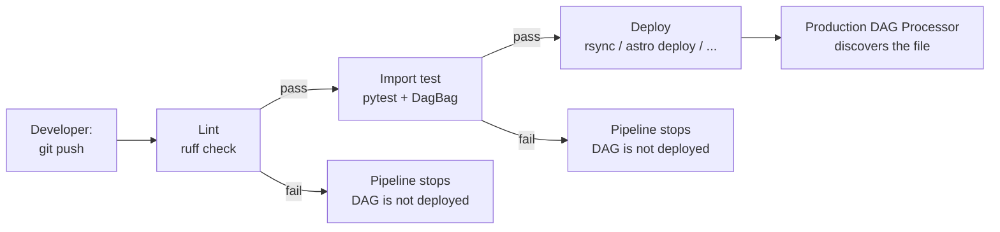
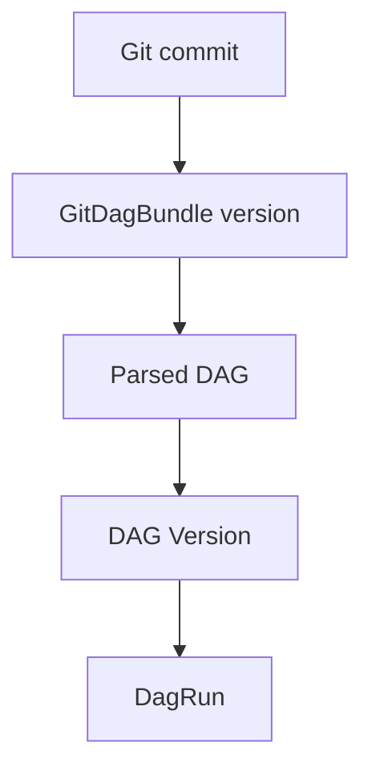
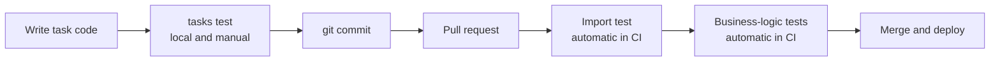
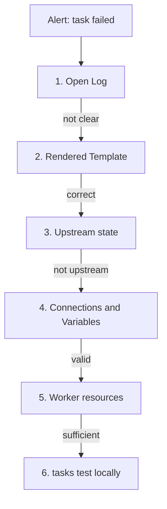
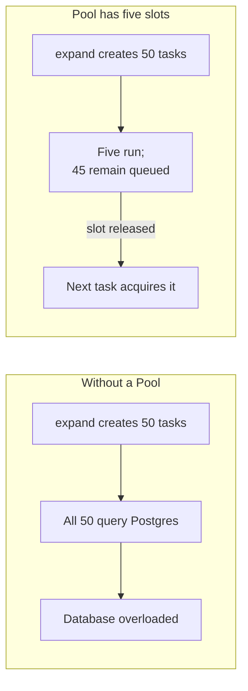
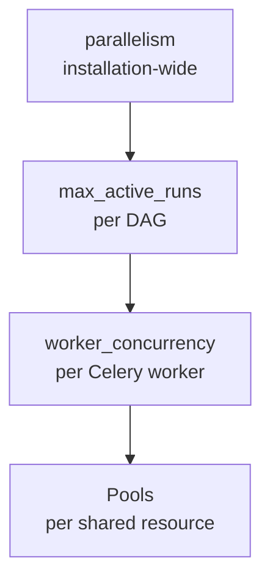

# 1. Production Best Practices

**Version Control and CI/CD**

We begin with an import test and a DAG containing an intentionally missing dependency. `DagBag()` uses the same basic mechanism as the DAG Processor: it scans the configured DAG folder, imports every Python file, and records the result.

**Exercise**

_Task:_ Break an import in one DAG file, run the integrity test, observe the failure, and then fix it.

```python
from airflow.decorators import dag, task
from datetime import datetime
import nonexistent_module  # Intentionally missing.

@dag(schedule="@daily", start_date=datetime(2026, 1, 1), catchup=False)
def broken_import_dag():
	@task
	def run():
		print("This task will never run")

	run()

broken_import_dag()
```

```python
from airflow.models import DagBag

def test_no_import_errors():
	dag_bag = DagBag()
	assert len(dag_bag.import_errors) == 0
```

```bash
pytest tests/test_dag_integrity.py -v
```

`dag_bag.import_errors` contains `ModuleNotFoundError: No module named 'nonexistent_module'` and the path to the broken file. Any import-time exception, including `SyntaxError`, `NameError`, or an unhandled top-level exception, is recorded in this dictionary.

> [!example]- Solution
> Remove `import nonexistent_module` and run the test again. It should pass.

_Common mistakes:_

1. `DagBag()` without an explicit `dag_folder` uses `AIRFLOW__CORE__DAGS_FOLDER`, not necessarily the current directory. Finding zero DAGs can create a false-positive test.
2. A successful import test proves only importability, not correct dependencies or business logic.
3. A long-lived Python process may retain a stale module in its import cache.

**Check yourself:**

1. If `DagBag()` finds zero DAGs, does `test_no_import_errors` pass?
2. Does a passing import test prove that the dependency graph is correct?

> [!example]- Answers
> 1. Yes. `import_errors` is empty because nothing was scanned, which is a false positive if DAGs were expected.
> 2. No. It verifies imports, not graph structure or behavior.

**Deployment: Development to Production**

Use pinned, compatible Airflow and provider versions in every environment through `requirements.txt` and constraints files. Configure Connections and Variables separately for development, staging, and production. Never hardcode production credentials in DAG code.

```yaml
# .github/workflows/deploy-dags.yml
name: Deploy Airflow DAGs

on:
  push:
	branches: [main]
	paths: ["dags/**"]

jobs:
  test-and-deploy:
	runs-on: ubuntu-latest
	steps:
	  - uses: actions/checkout@v4

	  - name: Set up Python
		uses: actions/setup-python@v5
		with:
		  python-version: "3.12"

	  - name: Install dependencies
		run: pip install -r requirements.txt

	  - name: Lint
		run: ruff check dags/

	  - name: Import test
		run: pytest tests/test_dag_integrity.py -v

	  - name: Deploy to the Composer bucket
		if: success()
		run: gsutil -m rsync -r dags/ gs://${{ secrets.COMPOSER_BUCKET }}/dags/
```



The import test is the gate that prevents an unimportable DAG from reaching production. The delivery command depends on the platform:

- `gsutil rsync` for Cloud Composer.
- `aws s3 sync` for Amazon MWAA.
- `astro deploy` for Astronomer.
- Git plus a git-sync sidecar for self-hosted Kubernetes.

**GitDagBundle: An Airflow 3 Alternative**

Traditional deployment copies DAG files into a bucket or volume. A **DAG Bundle** lets the DAG Processor obtain DAG files directly from a source such as Git.

```ini
[dag_processor]
dag_bundle_config_list = [
	{
		"name": "my_git_bundle",
		"classpath": "airflow.providers.git.bundles.git.GitDagBundle",
		"kwargs": {
			"tracking_ref": "main",
			"git_conn_id": "my_git_conn"
		}
	}
]
```

`git_conn_id` references an Airflow Connection containing repository access details. `tracking_ref` can be a branch, tag, or commit SHA. With `main`, the DAG Processor periodically checks for new commits without a separate rsync or git-sync deployment step.

`GitDagBundle` still uses local bundle storage and a checkout. The difference is that Airflow manages retrieval and updates rather than an external delivery process.

**Relationship to DAG Versioning**

`GitDagBundle` is versioned: one bundle version corresponds to one Git commit. Airflow can associate a DagRun with the source revision from which it was created.



A Git commit and a DAG Version are not the same object. Git versions the bundle, while Airflow separately versions parsed DAGs. It is therefore inaccurate to say that every commit automatically creates a new DAG Version for every DAG.

`LocalDagBundle`, the ordinary local DAG folder, has no bundle versioning. A deployment system must record the relationship between deployed local files and Git history itself.

**Production practices:**

- Use separate Connections and Variables in each environment. The same `conn_id` can resolve to different systems.
- Use Variables as feature flags for gradual rollout.
- Pin Airflow and provider versions.
- Track `main` for automatic updates or a commit SHA for a deterministic source.

**Exercise**

If `Lint` fails in the workflow, is the DAG deployed?

> [!example]- Solution
> No. The job stops, and `if: success()` requires every preceding step to succeed.

**When a Broken DAG Reaches Production**

Production-data bugs can pass import and structure tests. Do not patch DAG code directly on the server or through the read-only Code view.

1. Run `git revert` for the offending commit.
2. Deploy the revert through the same `Lint` → `Import test` → `Deploy` pipeline.

DagRuns that started from the broken DAG Version do not switch to a corrected graph halfway through execution. After rollback, inspect running versions and decide whether to let affected runs finish or stop them explicitly.

**Testing and Debugging**

Four levels catch different failure classes:

1. **Import test** with `DagBag`: DAG files can be imported.
2. **Structure test**: the graph contains expected tasks, dependencies, owners, and policies.
3. **Unit tests**: extracted business logic behaves correctly without Airflow.
4. **`airflow tasks test`**: one task can be executed locally for fast diagnosis.



**Structure Test**

```python
from airflow.models import DagBag

def test_dag_structure():
	dag_bag = DagBag()
	dag = dag_bag.get_dag("order_report")

	assert dag is not None, "DAG order_report was not found"
	assert len(dag.tasks) == 4, f"Expected 4 tasks, found {len(dag.tasks)}"

	task_ids = {task.task_id for task in dag.tasks}
	assert "extract_orders" in task_ids
	assert "print_report" in task_ids

	extract_task = dag.get_task("extract_orders")
	downstream_ids = {task.task_id for task in extract_task.downstream_list}
	assert "clean_orders" in downstream_ids, "clean_orders must follow extract_orders"
```

This test fails if a pull request removes the dependency between `extract_orders` and `clean_orders`, even though the DAG still imports.

**Unit Tests for Business Logic**

_Hard-to-test task:_

```python
@task
def clean_orders(orders: list):
	cleaned = [order for order in orders if order > 0]
	if not cleaned:
		raise ValueError("No valid orders remain after cleaning")
	return cleaned
```

_Extracted, testable logic:_

```python
def clean_orders_logic(orders: list) -> list:
	cleaned = [order for order in orders if order > 0]
	if not cleaned:
		raise ValueError("No valid orders remain after cleaning")
	return cleaned

@task
def clean_orders(orders: list):
	return clean_orders_logic(orders)
```

```python
import pytest
from dags.order_report import clean_orders_logic

def test_removes_non_positive_values():
	assert clean_orders_logic([120.5, -15.0, 340.0, 0.0]) == [120.5, 340.0]

def test_raises_when_nothing_remains():
	with pytest.raises(ValueError):
		clean_orders_logic([-5.0, 0.0, -1.0])
```

These tests run without Airflow or the metadata database.

**Exercise:** Run `airflow tasks test` against one of your existing workshop DAGs.

**Check yourself:**

1. Which level is most useful while iterating on one task?
2. Does a test for extracted business logic require Airflow?

> [!example]- Answers
> 1. `airflow tasks test`, because it gives fast task-level feedback.
> 2. No. Ordinary Python logic can be tested independently.

# 2. Diagnostics and Optimization

**Task-Failure Checklist**

Check the cheapest and most informative evidence first:

1. Open the failed TaskInstance **Log**.
2. Inspect **Rendered Template** for actual Jinja substitutions.
3. Check upstream states. A task in `upstream_failed` was never attempted.
4. Verify Connections and Variables.
5. Check worker resources for OOM kills, CPU pressure, or insufficient Pod limits.
6. Reproduce with `airflow tasks test`.



**Exercise**

```python
from airflow.decorators import dag
from airflow.operators.bash import BashOperator
from datetime import datetime

@dag(schedule="@daily", start_date=datetime(2026, 1, 1), catchup=False)
def broken_template_dag():
	BashOperator(
		task_id="print_date",
		bash_command="echo 'Processing {{ dss }}'",  # Typo.
	)

broken_template_dag()
```

Trigger the DAG. The Log reports that `dss` is undefined, and Rendered Template shows the invalid expression. Reproduce it with:

```bash
airflow tasks test broken_template_dag print_date 2026-01-01
```

> [!example]- Solution
> Use `bash_command="echo 'Processing {{ ds }}'"`.
>
> This is valid Python, so an import test cannot catch the error. It appears during template rendering.

**Performance Optimization**

- Do not perform expensive work at module level.
- Read Variables inside tasks rather than during parsing.
- Use TaskGroup to organize large graphs.
- Use Dynamic Task Mapping instead of hundreds of similar DAGs.
- Use Pools to protect shared external resources.

**TaskGroup**

TaskGroup organizes tasks visually inside one DAG. It does not create another DagRun and replaces the removed `SubDagOperator` pattern.

```python
from airflow.decorators import dag, task
from airflow.utils.task_group import TaskGroup
from datetime import datetime

@dag(schedule="@daily", start_date=datetime(2026, 1, 1), catchup=False)
def taskgroup_demo():
	@task
	def extract():
		return {"raw": 1}

	with TaskGroup(group_id="transform_group") as transform_group:
		@task
		def clean(data):
			return data

		@task
		def enrich(data):
			return data

		enrich(clean(extract()))

	@task
	def load():
		print("Loading")

	transform_group >> load()

taskgroup_demo()
```

**Pools**

Pools limit how many tasks can concurrently use a shared resource.

```bash
airflow pools set postgres_pool 5 "At most five production Postgres connections"
```

```python
@task(pool="postgres_pool")
def query_postgres():
	hook = PostgresHook(postgres_conn_id="my_postgres")
	return hook.get_first("SELECT COUNT(*) FROM my_table;")
```



**Exercise:** Add `pool="postgres_pool"` to the mapped task from the **Dynamic Task Mapping** material. Create one slot and observe sequential execution.

**Check yourself:**

1. What is the difference between TaskGroup and a Pool?
2. Does an unassigned Pool limit any task?

> [!example]- Answers
> 1. TaskGroup changes presentation; a Pool limits actual concurrency.
> 2. No. Tasks must reference it through `pool=`.

**Common Production Mistakes**

**Non-idempotent Writes**

_Anti-pattern:_

```python
@task
def store_daily_total(report: dict):
	hook = PostgresHook(postgres_conn_id="my_postgres")
	hook.run(
		"INSERT INTO daily_totals (report_date, total) VALUES (%s, %s)",
		parameters=(report["report_date"], report["total"]),
	)
```

_Idempotent upsert:_

```python
@task
def store_daily_total(report: dict):
	hook = PostgresHook(postgres_conn_id="my_postgres")
	hook.run(
		"INSERT INTO daily_totals (report_date, total) VALUES (%s, %s) "
		"ON CONFLICT (report_date) DO UPDATE SET total = EXCLUDED.total",
		parameters=(report["report_date"], report["total"]),
	)
```

Retries and backfills are platform features; idempotency remains the DAG author's responsibility.

**Physical Time Instead of Logical Time**

```python
# Anti-pattern: changes on every physical attempt.
@task
def tag_report(report: dict):
	from datetime import datetime
	report["processed_at"] = datetime.now().isoformat()
	return report

# Deterministic for one logical run.
@task
def tag_report_deterministic(report: dict, **context):
	report["processed_at"] = context["ds"]
	return report
```

A retry or backfill changes `datetime.now()`, while `ds` remains tied to the logical interval.

**Confusing `catchup` Defaults**

Airflow 2.x defaulted `catchup` to `True`; Airflow 3 defaults it to `False`. In 3.x, explicitly enable catchup when historical intervals are required.

# 3. Monitoring, Security, and Scaling

**Monitoring and Observability**

Production deployments combine metrics through StatsD or Prometheus, alert callbacks, distributed traces, and remote logs in S3, GCS, or Elasticsearch.

**Failure and Success Callbacks**

```python
from airflow.decorators import dag, task
from datetime import datetime

def notify_on_failure(context):
	task_instance = context["task_instance"]
	print(
		f"Task {task_instance.dag_id}.{task_instance.task_id} failed. "
		f"Log: {task_instance.log_url}"
	)

@dag(
	schedule="@daily",
	start_date=datetime(2026, 1, 1),
	catchup=False,
	default_args={"on_failure_callback": notify_on_failure},
)
def monitored_pipeline():
	@task
	def risky_task():
		raise ValueError("Something went wrong")

	risky_task()

monitored_pipeline()
```

| Callback | Runs when | Does not run when |
| --- | --- | --- |
| `on_failure_callback` | Task becomes `failed` | Task succeeds, even if it is slow |
| `on_success_callback` | Task becomes `success` | Task fails or is skipped |

**Deadlines and Legacy SLAs**

Older Airflow versions used task-level SLA settings and `sla_miss_callback`. Airflow 3 removed the legacy SLA mechanism. Modern Airflow 3 deployments should use **Deadline Alerts** where supported, or external duration and freshness alerts based on metrics.

- Failure alert: “Did the task fail?”
- Deadline or duration alert: “Did the work finish by the expected time?”

> [!example]- Check yourself
> A task succeeds after 45 minutes instead of the expected 30. `on_failure_callback` does not run because the task succeeded; a deadline, duration, or freshness alert is required.

**Security: RBAC and Secrets**

**Role-Based Access Control**

Apply least privilege so one team cannot modify another team's pipelines. Exact built-in roles and permission names depend on the Airflow version and authentication manager.

```python
from airflow.decorators import dag
from datetime import datetime

@dag(
	schedule="@daily",
	start_date=datetime(2026, 1, 1),
	catchup=False,
	access_control={
		"data_team": {"can_read", "can_edit", "can_delete"},
		"analytics_viewers": {"can_read"},
	},
)
def restricted_dag():
	...
```

**Secrets Backend**

```ini
[secrets]
backend = airflow.providers.hashicorp.secrets.vault.VaultBackend
backend_kwargs = {"connections_path": "airflow/connections", "variables_path": "airflow/variables", "url": "https://vault.example.com:8200"}
```

After this change, `PostgresHook(postgres_conn_id="my_postgres")` works without DAG-code changes. Airflow resolves the Connection from Vault instead of the metadata database. Other backends include AWS Secrets Manager, GCP Secret Manager, and Azure Key Vault.

The Fernet key encrypts sensitive fields stored in the metadata database. A Secrets Backend keeps secrets outside that database entirely.

**Check yourself:**

1. Must task code change when moving to a Secrets Backend?
2. Do Fernet and a Secrets Backend solve the same problem?

> [!example]- Answers
> 1. No. The stable `conn_id` remains unchanged.
> 2. No. Fernet encrypts stored fields; a Secrets Backend externalizes secrets.

**Scaling**

- `parallelism`: installation-wide task concurrency limit, subject to version-specific semantics.
- `max_active_runs`: concurrent DagRuns allowed for one DAG.
- `worker_concurrency`: tasks one Celery worker can execute concurrently.
- **Pools**: limits for a named shared resource across DAGs.



**Exercise**

A team runs 50 nightly dbt models with LocalExecutor and plans to grow to 500 models plus concurrent ML pipelines. What should be reviewed first?

> [!example]- Discussion
> Consider CeleryExecutor for a predictable distributed pool or KubernetesExecutor for per-task isolation. Add Pools around shared databases and APIs, then revisit `parallelism`, `max_active_runs`, worker resources, Scheduler capacity, and metadata-database capacity.

**Check yourself:**

1. How does `max_active_runs` differ from `parallelism`?
2. Is a Pool equivalent to a system-wide concurrency limit?

> [!example]- Answers
> 1. `max_active_runs` limits concurrent runs of one DAG; `parallelism` limits task concurrency across the installation.
> 2. No. A Pool protects a named resource and affects only assigned tasks.

# Day 3 Wrap-up

The three days covered Airflow foundations, architecture, DAGs, Tasks, Operators, Assets, TaskFlow, XCom, Sensors, Hooks, Dynamic Task Mapping, dbt integration from BashOperator to Cosmos and Asset-driven workflows, and production practices for CI/CD, testing, diagnostics, monitoring, security, and scaling.

# Hands-on checklist

- Run Airflow locally with Docker Compose.
- Build a TaskFlow DAG with at least three tasks.
- Add a Sensor and Hook for an external system.
- Use Dynamic Task Mapping with a real project list.
- Configure a database Connection and execute a query.
- Wrap a real dbt project with Cosmos.
- Add a `DagBag` import test and a graph structure test.
- Discuss Pools and concurrency limits against real infrastructure.
- Define failure, duration, and freshness alerts for a production pipeline.